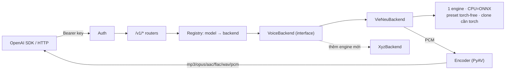

<div align="center">

# all-voice

**API Text-to-Speech tương thích OpenAI, đa backend — backend đầu tiên: VieNeu-TTS (tiếng Việt, ưu tiên CPU)**

Tiếng Việt | [Kiến trúc & mở rộng](docs/kien-truc-va-mo-rong.md) · [Triển khai](docs/deployment.md)

[](https://www.python.org/)
[](https://fastapi.tiangolo.com/)
[](https://docs.astral.sh/uv/)
[](https://platform.openai.com/docs/api-reference/audio)
[](https://github.com/pnnbao97/VieNeu-TTS)

</div>

## Tổng quan

`all-voice` là một cổng (gateway) Text-to-Speech: bên ngoài nói **chuẩn OpenAI Audio
API**, bên trong cắm **bất kỳ engine TTS nào**. Phần lõi không bao giờ import trực
tiếp một engine cụ thể — nó chỉ nói chuyện qua một interface `VoiceBackend` duy nhất
thông qua registry, nên **thêm engine mới = 1 file adapter, không đụng phần lõi**.

SDK `openai` gốc chạy được ngay, không cần sửa. Backend đầu tiên là
[VieNeu-TTS](https://github.com/pnnbao97/VieNeu-TTS) — tiếng Việt. Một engine
duy nhất lo cả preset lẫn clone: trên CPU là engine ONNX (đọc preset **không cần
torch**); **clone giọng cần thêm PyTorch** (speaker encoder của VieNeu dùng torch
để tiền xử lý, kể cả trên engine ONNX).



## ✨ Tính năng

| | |
|---|---|
| 🔌 **Tương thích OpenAI** | `audio.speech`, giọng tùy chỉnh, models — cắm thẳng vào SDK `openai` |
| 🧩 **Backend cắm-rút** | Engine mới = 1 adapter, tự xuất hiện trong `/v1/models` & `/v1/voices` |
| 🎙️ **Clone giọng** | Enrol một lần từ mẫu 3–8s, tái dùng mãi bằng `voice_id` (lưu trên đĩa) |
| 🎬 **Speech-to-Text** | `audio.transcriptions` → phụ đề **SRT/VTT** + timing câu/từ (faster-whisper); không dịch |
| 🎛️ **Knob tinh chỉnh** | Chỉ `style` (kiểu đọc) — qua `extra_body`; sampling để VieNeu tự lo |
| ⚡ **Ưu tiên CPU** | Preset ONNX không cần torch & nhanh; clone giọng cần thêm PyTorch |
| 🔊 **6 định dạng** | mp3 · opus · aac · flac · wav · pcm (PyAV, không cần FFmpeg hệ thống) |
| 🩺 **Dễ debug** | Log stdout + file xoay vòng, độ trễ từng request, traceback lỗi 500 |

## 🚀 Bắt đầu nhanh

<details>
<summary><b>Yêu cầu</b></summary>

- **[uv](https://docs.astral.sh/uv/)** — tự tải sẵn Python 3.12 đã ghim cho bạn.
- Không cần FFmpeg hệ thống (PyAV đã kèm). Cần ~350 MB đĩa trống cho model.

Cài uv (Linux/macOS): `curl -LsSf https://astral.sh/uv/install.sh | sh`
</details>

```bash
cp .env.example .env               # đặt API_KEYS
uv sync --extra clone              # deps + VieNeu + PyTorch (cho clone giọng)
uv run uvicorn app.main:app --host 0.0.0.0 --port 8123
```

> [!IMPORTANT]
> Đặt `API_KEYS` thật trong `.env` trước khi mở service ra ngoài — đừng để `dev-key`.

> [!NOTE]
> Model VieNeu (~313 MB) tải ở **request synth đầu tiên**, cache tại
> `~/.cache/huggingface/hub` (đổi bằng `HF_HOME`).

Tài liệu API tương tác (tự sinh): **`http://localhost:8123/docs`** (Swagger) ·
`/redoc` · `/openapi.json`.

## 🔌 API Endpoints

Mọi route `/v1/*` cần header `Authorization: Bearer <key>`.

| Method | Path | Mô tả |
|--------|------|-------|
| `POST` | `/v1/audio/speech` | Tổng hợp giọng nói (schema OpenAI) |
| `POST` | `/v1/audio/transcriptions` | Nhận dạng giọng → transcript + phụ đề (cần extra `asr`) |
| `GET`  | `/v1/models` | Liệt kê các backend đã đăng ký |
| `GET`  | `/v1/voices` | Liệt kê giọng preset + giọng clone (mọi backend) |
| `POST` | `/v1/audio/voices` | Tạo giọng clone (multipart) |
| `GET` · `DELETE` | `/v1/audio/voices/{id}` | Lấy / xóa một giọng clone |
| `POST` | `/v1/audio/voice_consents` | Cấp consent id (để tương thích OpenAI) |
| `GET`  | `/health` | Kiểm tra sống (không cần auth) |

**Dùng với SDK OpenAI (không sửa gì):**

```python
from openai import OpenAI

client = OpenAI(base_url="http://localhost:8123/v1", api_key="dev-key")
client.audio.speech.create(
    model="vieneu", voice="Trúc Ly",
    input="Xin chào, đây là all-voice.", response_format="mp3",
).stream_to_file("out.mp3")
```

> [!TIP]
> `model="tts-1"` và các tên giọng OpenAI (`alloy`, …) cũng được chấp nhận: model lạ
> sẽ route về backend mặc định, giọng lạ về preset đầu tiên.

## 🎙️ Clone giọng

Enrol (`add_voice`) tốn vài chục giây nên là bước **một lần duy nhất** — bạn không
bao giờ phải tải lại mẫu cho mỗi request.

```python
# 1) Enrol một lần -> nhận voice_id (lưu trên đĩa, sống qua restart).
voice = client.audio.voices.create(name="My Voice", audio_sample=open("ref.wav", "rb"))

# 2) Tái dùng mãi bằng id.
client.audio.speech.create(model="vieneu", voice=voice.id,
                           input="Xin chào!", response_format="mp3").stream_to_file("out.mp3")
```

Server mặc định tự sinh `voice_id` ngẫu nhiên duy nhất (`voice_…`) nếu không truyền `id`. Bạn cũng có thể **truyền `id` cố định** (ví dụ `id="voice_mc_nam"`) để khi cần cập nhật/ghi đè file mẫu mới thì ID không bị thay đổi. Mẫu lưu ở `data/voices/` (`samples/` + `registry.json`) và được enrol lại lúc khởi động.

**Để clone cho chuẩn.** Độ giống phụ thuộc vào mẫu tham chiếu và knob `denoise`
lúc enrol (mặc định bật, được lưu lại để restart tái tạo đúng y giọng cũ):

| Field | Mặc định | Khi nào đổi / Ý nghĩa |
|-------|----------|-----------------------|
| `id` | `None` (auto) | **(Tùy chọn)** ID tùy chỉnh cố định (vd `voice_mc_nam`). Nếu trùng ID cũ, hệ thống sẽ ghi đè và nạp lại weights mới. |
| `denoise` | `true` | Đặt **`false`** nếu mẫu **đã sạch**/thu studio — khử nhiễu ép có thể làm mờ chất giọng. Giữ `true` cho mẫu ồn (điện thoại/phòng vang). |

> `use_ref_codes` không còn là tham số đầu vào; nó luôn bật (`true`) bên trong để
> clone chuẩn nhất.

```python
# Mẫu gửi kèm ID cố định và tắt denoise (nếu mẫu đã sạch):
import httpx
httpx.post("http://localhost:8123/v1/audio/voices",
           headers={"Authorization": "Bearer dev-key"},
           data={"name": "MC Nam", "id": "voice_mc_nam", "denoise": "false"},
           files={"audio_sample": open("clean_ref.wav", "rb")})
```

**Yêu cầu mẫu** (quan trọng ngang các knob): 3–8s, **một người nói**, nền sạch
(không nhạc/echo), nói rõ và có ngữ điệu. VieNeu tự cắt silence 2 đầu và trộn về
mono, nhưng **không** tự cắt clip quá dài — clip dài hoặc nhiều giọng sẽ làm loãng
speaker embedding.

## 🎛️ Knob tinh chỉnh

Chỉ còn **một** knob duy nhất là `style`, truyền qua `extra_body` của SDK (client
chuẩn không bị ảnh hưởng):

```python
client.audio.speech.create(
    model="vieneu", voice="Trúc Ly", input="Ngày xửa ngày xưa...",
    extra_body={"style": "doc_truyen"},
)
```

`style` (tu_nhien/tin_tuc/doc_truyen) — kiểu đọc: tự nhiên / bản tin / kể chuyện.
Các tham số sampling (`temperature`, `top_k`, `top_p`, `repetition_penalty`,
`silence_p`, `crossfade_p`, `max_chars`) **không còn được phơi ra** — VieNeu tự lo
theo mặc định nội bộ. Field `speed` của OpenAI vẫn **được chấp nhận để tương thích**
nhưng là **no-op** với VieNeu. Cue cảm xúc (`[cười]`) và chuyển ngữ Việt⇄Anh chạy
inline ngay trong `input`.

## 🎬 Tạo phụ đề (Speech-to-Text)

Chiều ngược lại: **audio → transcript + mốc thời gian**, dùng
[faster-whisper](https://github.com/SYSTRAN/faster-whisper) (CTranslate2, int8 trên
CPU). Endpoint `POST /v1/audio/transcriptions` theo **đúng schema OpenAI** nên gọi
thẳng bằng SDK `openai`. **Chỉ nhận dạng + gắn mốc thời gian — không dịch.**

Cần cài thêm extra `asr` (không nằm trong base install cho nhẹ):

```bash
uv sync --extra asr        # kéo faster-whisper (thiếu extra → endpoint trả 503 rõ ràng)
```

```python
from openai import OpenAI
client = OpenAI(base_url="http://localhost:8123/v1", api_key="dev-key")

# Phụ đề SRT (hoặc "vtt") — trả thẳng chuỗi phụ đề.
srt = client.audio.transcriptions.create(
    model="whisper-1", file=open("bai_giang.mp3", "rb"), response_format="srt",
)
open("bai_giang.srt", "w", encoding="utf-8").write(srt)

# JSON đầy đủ: text + segments (mốc từng câu) + duration.
verbose = client.audio.transcriptions.create(
    model="whisper-1", file=open("bai_giang.mp3", "rb"), response_format="verbose_json",
)

# Karaoke: mốc từng TỪ (words[]) khi bật timestamp_granularities=["word"].
words = client.audio.transcriptions.create(
    model="whisper-1", file=open("bai_giang.mp3", "rb"),
    response_format="verbose_json", timestamp_granularities=["word"],
)
```

- `response_format`: `json` (mặc định, `{"text": ...}`) · `text` · `srt` · `vtt` · `verbose_json`.
- `timestamp_granularities=["word"]` (chỉ với `verbose_json`) thêm mảng `words[]`, mỗi
  từ có `start`/`end` — dùng cho hiệu ứng **karaoke**. Hiển thị do tool phía bạn tự lo.
- `model` nhận mọi tên (vd `whisper-1`) và dùng engine cấu hình; đổi model qua `ASR_MODEL`.

> [!NOTE]
> Model whisper (`small` ~0.5 GB) tải ở **request transcribe đầu tiên**, cache tại
> `~/.cache/huggingface/hub`. Đặt `ASR_MODEL=tiny` cho máy yếu / test nhanh.

## 🚢 Triển khai

Tự host trên Linux/macOS qua các script trong [`deploy/`](deploy/):

```bash
bash deploy/setup.sh                   # cài uv + deps đã khóa + .env + logs/
sudo bash deploy/install-service.sh    # chạy nền như service systemd (Linux)
```

Service tự khởi động lại khi crash và khi reboot — không giữ terminal. Hướng dẫn đầy
đủ: [docs/deployment.md](docs/deployment.md).

## 🩺 Log & Debug

Log ra **stdout + file xoay vòng** (`logs/app.log`, 5 MB × 5) — không dùng DB.

| Logger | Ghi gì |
|--------|--------|
| `all_voice.startup` | device, các backend, số giọng clone |
| `all_voice.request` | `METHOD path → status (độ trễ ms)` |
| `all_voice.speech` | mỗi lần synth: model / voice / định dạng / số ký tự / thời lượng |
| `all_voice.transcribe` | mỗi lần transcribe: model / bytes / định dạng / ngôn ngữ / số segment / thời lượng |
| `all_voice.error` | traceback lỗi 500 (đồng thời trả về envelope lỗi chuẩn OpenAI) |

`faulthandler` in traceback lỗi native (segfault) ra stderr. Dưới systemd,
`server.log` bắt cả uvicorn + stderr; `journalctl -u all-voice -f` xem realtime.

## ⚙️ Cấu hình (`.env`)

`API_KEYS` · `DEVICE` (cpu/cuda/auto) · `DEFAULT_BACKEND` · `MAX_CONCURRENCY` ·
`VOICES_DIR` · `HOST` · `PORT` (mặc định 8123) · `LOG_LEVEL` · `LOG_DIR` · `HF_HOME`.

**Speech-to-Text (extra `asr`):** `ASR_MODEL` (mặc định `small`; tiny/base/small/medium/large-v3
hoặc repo CTranslate2) · `ASR_COMPUTE_TYPE` (`int8` cho CPU, `float16` cho CUDA). ASR
**dùng chung `MAX_CONCURRENCY`** với TTS — cùng một ngân sách job CPU, tăng khi máy khỏe.

## 🧩 Thêm một Backend

1. Tạo `app/backends/<engine>_backend.py` kế thừa `VoiceBackend`
   (`name`, `list_voices()`, `synthesize()`).
2. Đăng ký trong `app/main._register_backends()`: `registry.register(MyBackend())`.

Không phải sửa router/schema/auth/encoder — nó tự xuất hiện trong `/v1/models` và
`/v1/voices`. Chi tiết: [docs/kien-truc-va-mo-rong.md](docs/kien-truc-va-mo-rong.md).

## 🧪 Test

```bash
uv sync --extra clone --extra asr   # test transcribe cần extra asr (dùng model tiny)
uv run pytest -q                     # end-to-end: dựng app, gọi mọi endpoint
```
