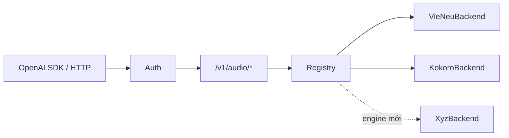

<div align="center">

# all-voice

**API Text-to-Speech tương thích OpenAI, đa engine — VieNeu (Việt) · Kokoro (Anh) · VOICEVOX (Nhật), ưu tiên CPU**

Tiếng Việt | [Kiến trúc & mở rộng](docs/kien-truc-va-mo-rong.md) · [Triển khai](docs/deployment.md) · [Hướng dẫn API](docs/api-reference.md)

[](https://www.python.org/)
[](https://fastapi.tiangolo.com/)
[](https://docs.astral.sh/uv/)
[](https://platform.openai.com/docs/api-reference/audio)

<a href="https://buymeacoffee.com/truongtt" target="_blank"></a>

<br/>


<p align="center"> </p>

*Giao diện Frontend của ứng dụng với tính năng Sinh giọng nói (TTS), Tạo phụ đề (Transcribe) và Nhân bản giọng nói (Clone).*

</div>

## Tổng quan

`all-voice` là một cổng (gateway) Audio API tương thích chuẩn OpenAI, cho phép cắm-rút bất kỳ engine TTS nào thông qua các adapter độc lập. Mặc định hệ thống tích hợp các model xuất sắc ưu tiên chạy trên CPU (ONNX).
Bạn có thể sử dụng trực tiếp SDK của OpenAI mà không cần thay đổi code.



## ✨ Tính năng

- 🔌 **Tương thích OpenAI**: Dùng trực tiếp với SDK `openai` gốc. Hỗ trợ đầy đủ `speech`, `transcriptions`, `voices`.
- 🧩 **Backend cắm-rút**: Thêm AI Engine mới chỉ với 1 file adapter.
- 🎙️ **Clone giọng**: Sinh giọng nói từ audio mẫu 3s - 8s.
- 🎬 **Speech-to-Text**: Nhận dạng giọng nói, tạo phụ đề **SRT/VTT** với mốc thời gian (timing) chuẩn xác.
- ⚡ **Tối ưu CPU**: Chạy mô hình ONNX trên CPU tốc độ cao (không bắt buộc dùng GPU).
- 🔊 **Đa định dạng**: Hỗ trợ xuất mp3, opus, aac, flac, wav, pcm.

## 🚀 Bắt đầu nhanh

Cài đặt [uv](https://docs.astral.sh/uv/) (Linux/macOS): `curl -LsSf https://astral.sh/uv/install.sh | sh`

```bash
cp .env.example .env               # Cấu hình API_KEYS của bạn
uv sync --extra clone              # Cài đặt (kèm extra cho clone giọng)
uv run uvicorn app.main:app --host 0.0.0.0 --port 8123
```

> **Chi tiết cách gọi API và cấu hình**: Xem [Hướng dẫn API (API Reference)](docs/api-reference.md).
> 
> **Triển khai Server (Systemd/Nginx)**: Xem [Hướng dẫn Triển khai](docs/deployment.md).

## ❤️ Mã nguồn mở được sử dụng

Dự án `all-voice` được xây dựng dựa trên sự đóng góp tuyệt vời từ cộng đồng mã nguồn mở. Xin gửi lời cảm ơn đến các tác giả của:

- **[VieNeu-TTS](https://github.com/pnnbao97/VieNeu-TTS)**: Động cơ TTS tiếng Việt xuất sắc.
- **[Kokoro-82M](https://github.com/thewh1teagle/kokoro-onnx)**: TTS tiếng Anh siêu nhẹ (Int8/FP16).
- **[VOICEVOX](https://github.com/VOICEVOX/voicevox_core)**: Công cụ tổng hợp giọng nói tiếng Nhật.
- **[Faster-Whisper](https://github.com/SYSTRAN/faster-whisper)**: Xử lý Speech-to-Text siêu tốc với CTranslate2.
- **[FastAPI](https://fastapi.tiangolo.com/)**: Web framework hiện đại, hiệu năng cao.

*Cảm ơn tác giả của VOICEVOX, các giọng nói tiếng Nhật đều tuân thủ yêu cầu ghi công nhân vật (vd `VOICEVOX:ずんだもん`).*

## 💖 Hỗ trợ dự án (Donate)

Nếu bạn thấy dự án hữu ích và muốn ủng hộ tác giả phát triển thêm các tính năng mới, bạn có thể donate qua các kênh sau:

- **Buy Me A Coffee**: [buymeacoffee.com/truongtt](https://buymeacoffee.com/truongtt) (Mua cho tác giả một ly cà phê ☕)
- **Momo / VietQR**: Bạn có thể quét mã QR Momo hoặc VietQR ngay trong giao diện ứng dụng (trên máy tính hoặc Mobile) ở phần **Ủng hộ (Donate)**.

Hoặc quét mã QR dưới đây để ủng hộ trực tiếp qua Vietcombank:

<p align="center"></p>

Cảm ơn bạn rất nhiều!
