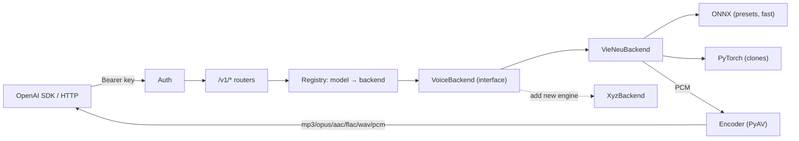

<div align="center">

# all-voice

**An OpenAI-compatible, multi-backend Text-to-Speech API — first backend: VieNeu-TTS (Vietnamese, CPU-first)**

English | [Tiếng Việt (kiến trúc & mở rộng)](docs/kien-truc-va-mo-rong.md)

[](https://www.python.org/)
[](https://fastapi.tiangolo.com/)
[](https://docs.astral.sh/uv/)
[](https://platform.openai.com/docs/api-reference/audio)
[](https://github.com/pnnbao97/VieNeu-TTS)

</div>

## Overview

`all-voice` is a Text-to-Speech gateway that speaks the **OpenAI Audio API** on the
outside and plugs in **any TTS engine** on the inside. The core never imports a
concrete engine — it talks to a single `VoiceBackend` interface through a registry,
so **adding a new engine is one adapter file, zero core changes**.

The stock `openai` SDK works unmodified. The first backend is
[VieNeu-TTS](https://github.com/pnnbao97/VieNeu-TTS) — Vietnamese, running torch-free
on ONNX for CPU, with PyTorch loaded only for voice cloning.



## ✨ Features

| | |
|---|---|
| 🔌 **OpenAI-compatible** | `audio.speech`, custom voices, models — drop-in for the `openai` SDK |
| 🧩 **Pluggable backends** | New engine = 1 adapter, auto-listed in `/v1/models` & `/v1/voices` |
| 🎙️ **Voice cloning** | Enrol once from a 3–8s sample, reuse forever by `voice_id` (persisted) |
| 🎛️ **Tuning knobs** | Style, pauses, sampling — via `extra_body`, VieNeu as the reference |
| ⚡ **CPU-first** | ONNX presets are torch-free & fast; PyTorch lazy-loaded only for clones |
| 🔊 **6 formats** | mp3 · opus · aac · flac · wav · pcm (PyAV, no system FFmpeg) |
| 🩺 **Debuggable** | Stdout + rotating file logs, per-request latency, 500 tracebacks |

## 🚀 Quick Start

<details>
<summary><b>Prerequisites</b></summary>

- **[uv](https://docs.astral.sh/uv/)** — it fetches the pinned Python 3.12 for you.
- No system FFmpeg needed (PyAV bundles it). ~350 MB free disk for the model.

Install uv (Linux/macOS): `curl -LsSf https://astral.sh/uv/install.sh | sh`
</details>

```bash
cp .env.example .env               # set API_KEYS
uv sync --extra clone              # deps + VieNeu + PyTorch (for cloning)
uv run uvicorn app.main:app --host 0.0.0.0 --port 8123
```

> [!IMPORTANT]
> Set a real `API_KEYS` in `.env` before exposing the service — don't ship `dev-key`.

> [!NOTE]
> The VieNeu model (~313 MB) downloads on the **first** synthesis request, cached in
> `~/.cache/huggingface/hub` (override with `HF_HOME`).

Interactive API docs (auto-generated): **`http://localhost:8123/docs`** (Swagger) ·
`/redoc` · `/openapi.json`.

## 🔌 API Endpoints

All `/v1/*` routes require `Authorization: Bearer <key>`.

| Method | Path | Description |
|--------|------|-------------|
| `POST` | `/v1/audio/speech` | Synthesize speech (OpenAI schema) |
| `GET`  | `/v1/models` | List registered backends |
| `GET`  | `/v1/voices` | List preset + cloned voices (all backends) |
| `POST` | `/v1/audio/voices` | Create a cloned voice (multipart) |
| `GET` · `DELETE` | `/v1/audio/voices/{id}` | Retrieve / delete a cloned voice |
| `POST` | `/v1/audio/voice_consents` | Issue a consent id (OpenAI-compat) |
| `GET`  | `/health` | Liveness (no auth) |

**With the OpenAI SDK (unmodified):**

```python
from openai import OpenAI

client = OpenAI(base_url="http://localhost:8123/v1", api_key="dev-key")
client.audio.speech.create(
    model="vieneu", voice="Trúc Ly",
    input="Xin chào, đây là all-voice.", response_format="mp3",
).stream_to_file("out.mp3")
```

> [!TIP]
> `model="tts-1"` and OpenAI voice names (`alloy`, …) are accepted too: an unknown
> model routes to the default backend, an unknown voice to the first preset.

## 🎙️ Voice Cloning

Enrolment (`add_voice`) costs tens of seconds, so it's a **one-time** step — you never
re-upload the sample per request.

```python
# 1) Enrol once -> get a voice_id (persisted to disk, survives restarts).
voice = client.audio.voices.create(name="My Voice", audio_sample=open("ref.wav", "rb"))

# 2) Reuse forever by id.
client.audio.speech.create(model="vieneu", voice=voice.id,
                           input="Xin chào!", response_format="mp3").stream_to_file("out.mp3")
```

The server generates a random unique `voice_id` (`voice_…`) — you only set `name`
(which may repeat freely). Samples live in `data/voices/` (`samples/` + `registry.json`)
and are re-enrolled at startup.

## 🎛️ Tuning Knobs

Pass VieNeu params via the SDK's `extra_body` (standard clients are unaffected):

```python
client.audio.speech.create(
    model="vieneu", voice="Trúc Ly", input="Ngày xửa ngày xưa...",
    speed=1.2, extra_body={"style": "doc_truyen", "silence_p": 0.3, "temperature": 0.6},
)
```

`style` (tu_nhien/tin_tuc/doc_truyen) · `temperature` · `top_k` · `top_p` ·
`repetition_penalty` · `silence_p` (pause length) · `crossfade_p` · `max_chars`.
`speed` (0.25–4.0) is applied gateway-side (pitch-preserving), so it works for every
backend. Emotion cues (`[cười]`) and VI⇄EN code-switching work inline in `input`.

## 🚢 Deployment

Self-hosted on Linux/macOS via [`deploy/`](deploy/) scripts:

```bash
bash deploy/setup.sh                   # install uv + locked deps + .env + logs/
sudo bash deploy/install-service.sh    # run as a systemd service (Linux, background)
```

The service auto-restarts on crash and boot — no terminal held. Full guide:
[docs/deployment.md](docs/deployment.md).

## 🩺 Logs & Debugging

Logs go to **stdout + a rotating file** (`logs/app.log`, 5 MB × 5) — no DB.

| Logger | What |
|--------|------|
| `all_voice.startup` | device, backends, cloned-voice count |
| `all_voice.request` | `METHOD path → status (latency ms)` |
| `all_voice.speech` | per synth: model / voice / format / chars / duration |
| `all_voice.error` | 500 tracebacks (also returns the OpenAI error envelope) |

`faulthandler` dumps native-crash (segfault) tracebacks to stderr. Under systemd,
`server.log` captures uvicorn + stderr; `journalctl -u all-voice -f` tails it live.

## ⚙️ Configuration (`.env`)

`API_KEYS` · `DEVICE` (cpu/cuda/auto) · `DEFAULT_BACKEND` · `MAX_CONCURRENCY` ·
`VOICES_DIR` · `HOST` · `PORT` (default 8123) · `LOG_LEVEL` · `LOG_DIR` · `HF_HOME`.

## 🧩 Add a Backend

1. Create `app/backends/<engine>_backend.py` subclassing `VoiceBackend`
   (`name`, `list_voices()`, `synthesize()`).
2. Register it in `app/main._register_backends()`: `registry.register(MyBackend())`.

No router/schema/auth/encoder change — it appears in `/v1/models` and `/v1/voices`
automatically. Details: [docs/kien-truc-va-mo-rong.md](docs/kien-truc-va-mo-rong.md).

## 🧪 Test

```bash
uv run pytest -q     # single end-to-end suite: spins up the app, hits every endpoint
```
