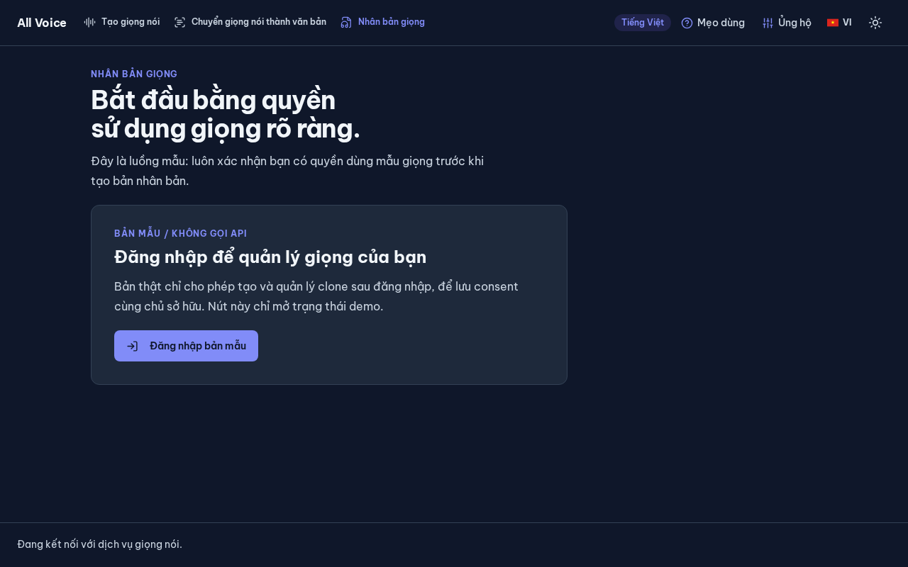
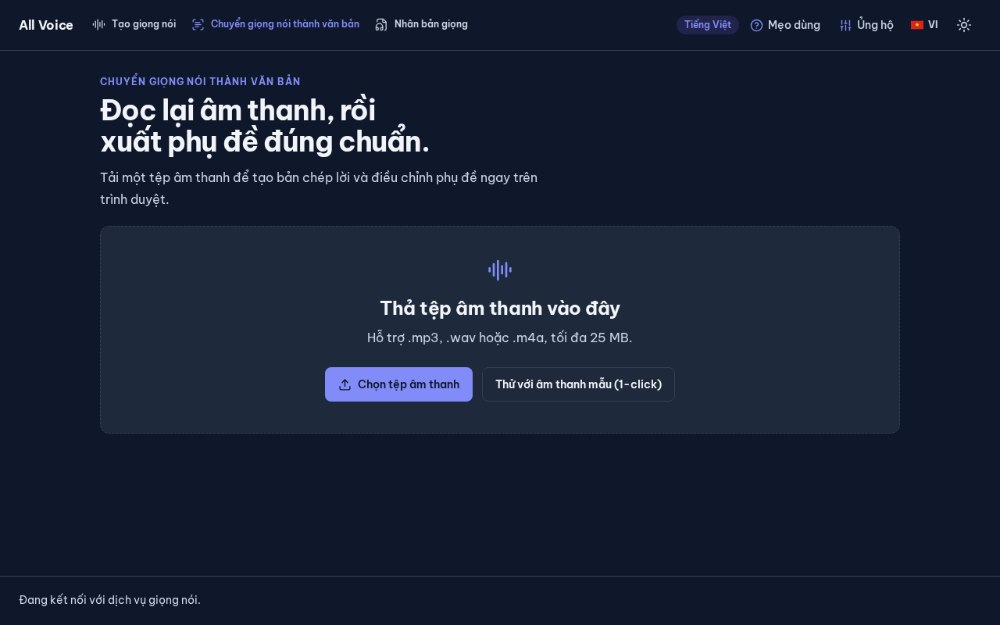
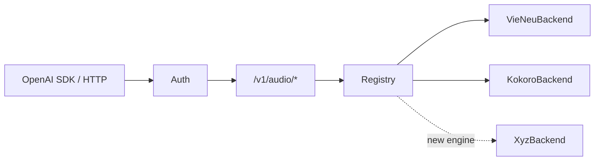
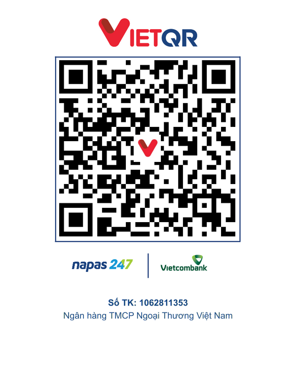

<div align="center">

# all-voice

**OpenAI-Compatible Text-to-Speech API, Multi-engine — VieNeu (Vietnamese) · Kokoro (English) · VOICEVOX (Japanese), CPU-First**

[Tiếng Việt](README.md) | English | [Architecture & Extensions](docs/kien-truc-va-mo-rong.md) | [Deployment](docs/deployment.md) | [API Reference](docs/api-reference.md)

[](https://www.python.org/)
[](https://fastapi.tiangolo.com/)
[](https://docs.astral.sh/uv/)
[](https://platform.openai.com/docs/api-reference/audio)

<a href="https://buymeacoffee.com/truongtt" target="_blank"></a>

<br/>


<p align="center"> </p>

*Frontend UI with Text-to-Speech (TTS), Speech-to-Text (Transcribe), and Voice Cloning features.*

</div>

## Overview

`all-voice` is an OpenAI-compatible Audio API gateway that allows plugging in any TTS engine via independent adapters. By default, it integrates excellent models that are optimized for CPU execution (ONNX).
You can use the native OpenAI SDK without any code changes.



## ✨ Features

- 🔌 **OpenAI Compatible**: Works out-of-the-box with the official `openai` SDK. Full support for `speech`, `transcriptions`, and `voices`.
- 🧩 **Pluggable Backends**: Add a new AI Engine by writing just a single adapter file.
- 🎙️ **Voice Cloning**: Synthesize speech from a 3–8s audio sample.
- 🎬 **Speech-to-Text**: Voice recognition and subtitle generation (**SRT/VTT**) with accurate word-level timing.
- ⚡ **CPU Optimized**: Runs ONNX models efficiently on CPU (GPU is not required).
- 🔊 **Multi-format**: Supports exporting to mp3, opus, aac, flac, wav, and pcm.

## 🚀 Quick Start

Install [uv](https://docs.astral.sh/uv/) (Linux/macOS): `curl -LsSf https://astral.sh/uv/install.sh | sh`

```bash
cp .env.example .env               # Configure your API_KEYS
uv sync --extra clone              # Install (includes voice cloning deps)
uv run uvicorn app.main:app --host 0.0.0.0 --port 8123
```

> **API Calls & Configuration**: See [API Reference](docs/api-reference.md).
> 
> **Server Deployment (Systemd/Nginx)**: See [Deployment Guide](docs/deployment.md).
*(Note: Documentation is currently in Vietnamese)*

## ❤️ Open Source Credits

`all-voice` is built upon the wonderful contributions of the open-source community. Special thanks to the creators of:

- **[VieNeu-TTS](https://github.com/pnnbao97/VieNeu-TTS)**: Excellent Vietnamese TTS engine.
- **[Kokoro-82M](https://github.com/thewh1teagle/kokoro-onnx)**: Ultra-lightweight English TTS (Int8/FP16).
- **[VOICEVOX](https://github.com/VOICEVOX/voicevox_core)**: Japanese speech synthesis engine.
- **[Faster-Whisper](https://github.com/SYSTRAN/faster-whisper)**: Ultra-fast Speech-to-Text using CTranslate2.
- **[FastAPI](https://fastapi.tiangolo.com/)**: Modern, high-performance web framework.

*Thanks to the authors of VOICEVOX, all Japanese voices comply with character attribution requirements (e.g., `VOICEVOX:ずんだもん`).*

## 💖 Support the Project (Donate)

If you find this project useful and want to support the development of new features, you can donate via:

- **Buy Me A Coffee**: [buymeacoffee.com/truongtt](https://buymeacoffee.com/truongtt) (Buy the author a coffee ☕)
- **Momo / VietQR**: You can scan the Momo or VietQR code directly from the app's **Support (Donate)** section.

Or scan the QR code below to donate directly via Vietcombank:

<p align="center"></p>

Thank you very much!
