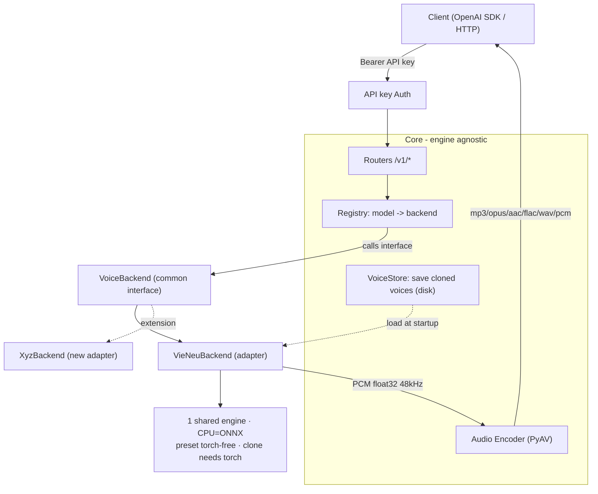
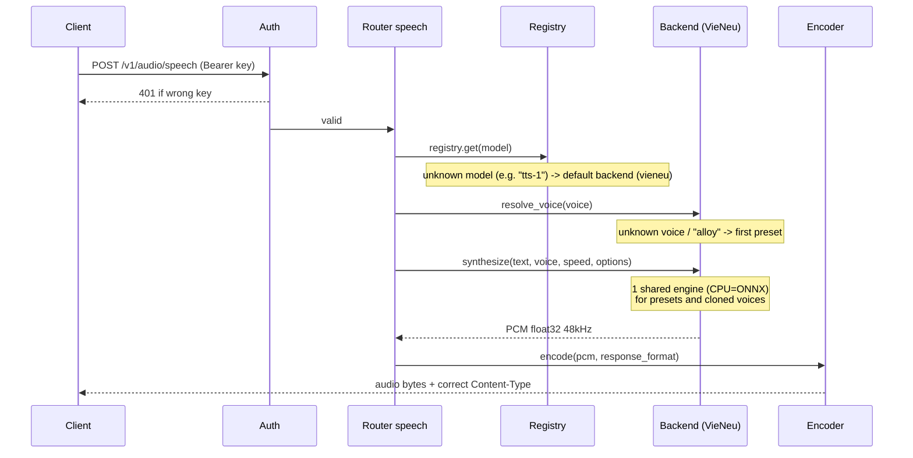
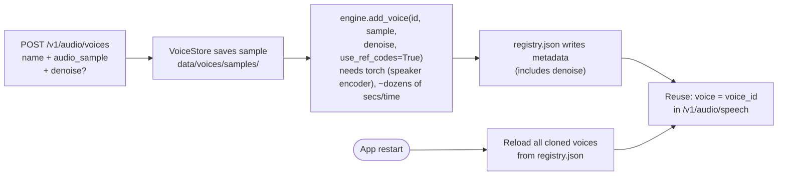
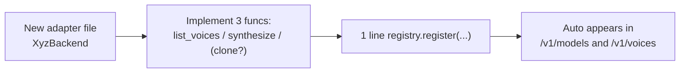
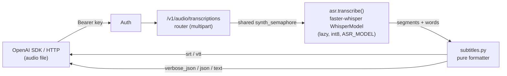
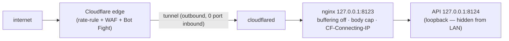

# all-voice — Architecture & Extensions (English)

This document explains how the system works, how to add a new voice model, how to configure it, and where the downloaded models are stored.

> Diagrams use **Mermaid** syntax — view them visually using VSCode (Mermaid extension), GitHub, or any Markdown viewer that supports Mermaid.

---

## 1. Core Idea

A **TTS (text-to-speech) gateway** that exposes an API **identical to OpenAI**, but underneath can plug in **multiple "voice backends"**. The core does not know about specific engines — it only talks to a **common interface** (`VoiceBackend`) via a **registry**. Adding a new engine = writing **1 adapter file**, without modifying the core.

The first backend: **VieNeu-TTS** (Vietnamese, runs well on CPU). VieNeu is chosen as the **reference standard** for tuning parameters (style, pauses...); other backends will *map* their parameter names to this standard, or ignore them if not supported.

Design priorities: **(1) Performance → (2) Simplicity (KISS) → (3) Extensibility → (4) CPU-first, GPU optional.**

---

## 2. Overall Architecture Diagram



**Key point:** Routers/Auth/Encoder/Schemas **only** depend on the `registry` and the `VoiceBackend` interface. They **do not import** any specific backend.

---

## 3. Processing Flow of a `POST /v1/audio/speech` Request



Synthesis + encoding are **CPU-bound/blocking** so they are offloaded to a threadpool, limited by `MAX_CONCURRENCY`. VieNeu is **not thread-safe** → all synth calls are serialized using a lock in the backend.

---

## 4. Components & Files

| File | Role |
|---|---|
| `app/main.py` | Create app, register backends, reload cloned voices, mount routers, error handling |
| `app/config.py` | Configuration from `.env` (API keys, device, concurrency, voice dirs) |
| `app/auth.py` | Check `Authorization: Bearer <key>` |
| `app/schemas.py` | Request/response (matches OpenAI) + tuning knobs |
| `app/backends/base.py` | **Interface `VoiceBackend`** + `Voice`, `AudioResult` |
| `app/backends/registry.py` | `model -> backend` map, selects default backend |
| `app/backends/vieneu_backend.py` | VieNeu Adapter (1 shared engine; CPU=ONNX, clone needs torch) |
| `app/audio/encoder.py` | PCM → mp3/opus/aac/flac/wav/pcm (PyAV + stdlib) |
| `app/voice_store.py` | Saves cloned voice samples + registry.json (disk) |
| `app/routers/speech.py` | `POST /v1/audio/speech` |
| `app/routers/speech_timing.py` | `POST /v1/audio/speech/timing` (native VOICEVOX timing for SRT, does not alter OpenAI speech) |
| `app/routers/transcriptions.py` | `POST /v1/audio/transcriptions` (speech-to-text; see section 11) |
| `app/routers/models.py` | `GET /v1/models` |
| `app/routers/voices.py` | `GET /v1/voices` (combines presets + clones) |
| `app/routers/voices_admin.py` | CRUD cloned voices + consent (OpenAI standard) |
| `app/asr/` | Speech-to-Text module (separate from TTS): `transcriber.py` (faster-whisper) + `subtitles.py` (pure formatter) |

---

## 5. Configuration (`.env`) and Tuning Knobs

**Environment Variables:**

| Variable | Default | Meaning |
|---|---|---|
| `API_KEYS` | `dev-key` | List of keys, comma separated |
| `DEVICE` | `cpu` | `cpu` (ONNX) / `cuda` / `auto` |
| `DEFAULT_BACKEND` | `vieneu` | Backend that handles unknown models |
| `MAX_CONCURRENCY` | `2` | Max concurrent CPU jobs — **shared** for synth (TTS) and transcribe (ASR) |
| `VOICES_DIR` | `data/voices` | Where cloned voice samples are saved |
| `ASR_MODEL` | `small` | faster-whisper model (tiny/base/small/medium/large-v3 or CT2 repo) — see section 11 |
| `ASR_COMPUTE_TYPE` | `int8` | CTranslate2 compute type: `int8` (CPU) / `float16` (CUDA) |
| `ENABLE_KOKORO` | `true` | Enable Kokoro English engine (registers only if assets exist — see section 12) |
| `KOKORO_MODEL_PATH` | `models/kokoro/kokoro-v1.0.int8.onnx` | Path to Kokoro ONNX model |
| `KOKORO_VOICES_PATH` | `models/kokoro/voices-v1.0.bin` | Kokoro voices file |
| `KOKORO_DEFAULT_VOICE` | `af_heart` | Preset returned for lenient routing (OpenAI-generic model) |
| `ENABLE_VOICEVOX` | `true` | Enable VOICEVOX Japanese engine (registers only if assets exist — see section 12) |
| `VOICEVOX_DICT_DIR` | `models/voicevox/open_jtalk_dic_utf_8-1.11` | OpenJTalk dict directory |
| `VOICEVOX_VVM_DIR` | `models/voicevox/vvms` | VVM (voice model) directory |
| `VOICEVOX_ONNXRUNTIME` | `models/voicevox/onnxruntime/lib/libvoicevox_onnxruntime.so` | ONNX Runtime Lib (wheel DOES NOT bundle it); downloaded by `fetch-voicevox.sh` |
| `VOICEVOX_SPEAKER_ALLOWLIST` | *(empty)* | Filter exposed `style_id`/`uuid:style_id`; empty = all |
| `HF_HOME` | *(empty)* | Change model cache dir (see section 8) |

**Tuning Knobs** (sent via `extra_body` of OpenAI SDK; regular clients are unaffected):

| Knob | Value Range | Meaning |
|---|---|---|
| `style` | *(free string; backend defines valid values)* | Reading style. VieNeu accepts `tu_nhien` / `tin_tuc` / `doc_truyen`; unknown value → **400** (backend rejects, not schema) |
| `extra` | *(any object)* | Bag of parameters **specific to each engine** (e.g. `speedScale` of a future engine). Merged into options; backend **ignores** unknown keys. |

> **Provider-Neutral Routing:** `style` is no longer forced as a `Literal` in the common schema — each backend **validates** its own knobs (VieNeu throws `InvalidOption` → router maps to **400 `invalid_option`**). Thus, `style="tin_tuc"` can map to another engine, and new engine params go through `extra` **without modifying the schema**. If `style` overlaps with a key in `extra`, `style` wins.

Sampling parameters (`temperature`, `top_k`, `top_p`, `repetition_penalty`, `silence_p`, `crossfade_p`, `max_chars`) are **no longer input parameters** — VieNeu handles them using internal defaults (like VieNeu Studio).

**Reading Speed (`speed`, 0.25–4.0):** kept for **OpenAI SDK compatibility** and passed to the backend, but only works if the backend supports native speed adjustment. VieNeu **does not** → `speed` is a **no-op** for VieNeu. Gateway **does not** time-stretch (phase vocoder degrades voice quality).

**No Knobs Needed** (works out of the box in `input`):
- **Punctuation pauses:** write `,` `.` `…`, newlines → automatic pauses.
- **Emotions / non-verbal:** embed `[cười]` (laugh), `[thở dài]` (sigh) into text.
- **Vietnamese-English bilingual:** automatic code-switching.

> **Mapping for other backends:** since knob names follow VieNeu, adapters for other backends will self-translate (e.g., `style="tin_tuc"` → equivalent parameter of that engine), or ignore unsupported knobs. Core remains unchanged.

---

## 6. Voice Cloning — How it Works & Storage

**Cloning needs PyTorch** — but **not because ONNX can't clone**. An ONNX engine **can still enroll clones**; the key is that extracting the `speaker_emb` goes through `OnnxSpeakerEncoder`, which `import torch` at the top level (uses torch to preprocess fbanks/tensors). Empirically verified: **ONNX presets run fine, `add_voice` fails** without torch. 
Thus, we use **1 shared engine** (CPU=ONNX): presets don't need torch, cloning needs torch → gated by `supports_cloning = _torch_available()`.



- Samples stored in `data/voices/samples/`, metadata in `data/voices/registry.json`.
- **Survives restarts:** on startup, each voice is re-enrolled into the engine **with the saved `denoise`** → clone reproduces identically.
- Enroll takes ~dozens of secs (one-time); synthing a cloned voice is **faster than real-time** (~2×).

**High-fidelity cloning:** `speaker_emb` + `ref_codes` (extracted by `add_voice`) determine the voice quality. Only **one** input knob remains, `denoise` (persisted per voice):

| Field | Default | When to change |
|-------|----------|-------------|
| `denoise` | `true` | Set to **`false`** if the sample is **clean** (studio) — forced denoise can blur timbre. Keep `true` for noisy samples (phone/echo room). |

> `use_ref_codes` is always enabled (`true`) internally (no longer an input) to lock prosody/timbre — best cloning.

Good samples are as important as knobs: **3–8s, single speaker**, clean background (no music/echo), clear speech with intonation. VieNeu auto-trims silence on both ends + mono-mixes, but **does not** auto-cut over-long clips → long clips/multiple voices dilute the speaker embedding.

---

## 7. How to Add a New Voice Model (Full Guide)

Suppose we add an imaginary engine named **Piper**. Just **2 steps**, don't touch the core:

**Step 1 — Write adapter** `app/backends/piper_backend.py`:

```python
from __future__ import annotations
import numpy as np
from .base import AudioResult, Voice, VoiceBackend

class PiperBackend(VoiceBackend):
    name = "piper"                 # == "model" name sent by client
    supports_cloning = False       # this engine does not clone

    def list_voices(self) -> list[Voice]:
        return [Voice(id="vi_female_1", name="Piper VN female", model=self.name, language="vi")]

    def synthesize(self, text, voice, speed=1.0, options=None) -> AudioResult:
        options = options or {}
        # Map standard knobs (VieNeu) to Piper params, ignore missing:
        # e.g.: style -> Piper's own preset; unsupported knobs -> ignore.
        pcm = my_piper.tts(text)                 # -> np.float32 [-1, 1], mono
        return AudioResult(pcm=np.asarray(pcm, np.float32).reshape(-1), sample_rate=22050)
```

**Step 2 — Register** in `app/main.py::_register_backends()`:

```python
from .backends.piper_backend import PiperBackend
registry.register(PiperBackend())     # add exactly 1 line
```

Done. Automatically appears in `GET /v1/models` and `GET /v1/voices`; clients call using `model="piper"`. **No edits** to router/schema/auth/encoder.

- **Language = voice attribute:** assign `language` to each `Voice` (e.g. `"ja"`, `"en"`). Clients **select language by selecting voice/model**, there is no `language` field on the TTS request. Voices automatically appear in discovery filters `GET /v1/voices?model=<name>&language=<code>`.
- **Automatic strict routing:** `resolve_voice(voice, *, strict=…)` inherited from `base` handles it — client calls your model **by name** + unknown voice → **404 `unknown_voice`**; OpenAI-generic models (`tts-1`) falling back to default remain **lenient**. Adapters usually **do not need** to override.
- **Engine-specific knobs:** validate your own knobs and throw `InvalidOption` for bad values (router → **400**); read custom params from `options` (including request's `extra`). Ignore unknown keys.
- To support cloning: set `supports_cloning = True` and implement `register_voice(...)` + `remove_voice(...)`. Engine needs **reference text**? Read `options.get("ref_text")`, throw `InvalidOption` if missing. `ref_text` is sent via client during enroll, **persisted** in `enrol_options` and auto-passed on re-enroll.
- Encoder handles all formats — adapter **only needs to return PCM float32 + sample_rate** (any sample_rate is fine, encoder handles it; except `opus` needs 48/24/16/12/8kHz).

> **Multi-engine status:** besides VieNeu (VN), **Kokoro (EN)** and **VOICEVOX (JA)** are integrated — see **section 12**. Both are in-process adapters, no clone, registered with an `is_available()` guard.



---

## 8. Where Downloaded Models Are Located

Downloaded automatically on the **first synth request** into the **HuggingFace cache**:

```
~/.cache/huggingface/hub/
  models--pnnbao-ump--VieNeu-TTS-v3-Turbo          (~226 MB, main model)
  models--OpenMOSS-Team--MOSS-Audio-Tokenizer-Nano-ONNX  (~87 MB, audio tokenizer)
```

Total ~**313 MB**. On Windows: `C:\Users\<user>\.cache\huggingface\hub\`.

**Change location:** set `HF_HOME` (e.g. `HF_HOME=D:/youtube/all_voice/data/hf`) before running; models will be in `<HF_HOME>/hub/`. **Cloned** voice samples are kept separately in `data/voices/` (via `VOICES_DIR`), not in HF cache.

---

## 9. CPU / GPU

- `DEVICE=cpu` (default): 1 ONNX engine handles presets and clones. Presets read torch-free; **cloning enroll needs torch** (speaker encoder) → install `--extra clone`.
- `DEVICE=cuda`: A PyTorch engine handles everything (fast on GPU, has batching). Needs CUDA torch from PyTorch index, then set `DEVICE=cuda`.
- Install clone/GPU suite (PyTorch): `uv sync --extra clone`.

---

## 10. Run & Test

```bash
uv sync --extra clone
cp .env.example .env          # set API_KEYS
uv run uvicorn app.main:app --host 0.0.0.0 --port 8000
uv run pytest -q              # end-to-end test (real synth + real clone)
```

Endpoint/schema details are **not** written here — see **Auto-generated Swagger** at `http://localhost:8000/docs` (test API in browser), `/redoc`, or `/openapi.json`.

---

## 11. Speech-to-Text (ASR) — Module `app/asr/`

The reverse of TTS: **audio → transcript + timestamps**, exposed at `POST /v1/audio/transcriptions` (OpenAI standard). Engine is [faster-whisper](https://github.com/SYSTRAN/faster-whisper) (CTranslate2, int8 on CPU). **Recognition only — no translation.** Requires `asr` extra: `uv sync --extra asr`.



**Why separate, not registry?** ASR is **a single engine** (no multi-backend need like TTS), so a registry adds unnecessary complexity (KISS). Instead `app/asr/` is a standalone module, **completely detached** from `app/backends/` (TTS core): changing/upgrading ASR doesn't touch `VoiceBackend`/registry/speech router.

**Main seams:**

| Component | Role |
|---|---|
| `app/asr/transcriber.py` | `transcribe(audio_bytes, *, language, want_words, prompt, temperature)` → `TranscriptionResult`. Loads model **lazily** (process-wide singleton, `_get_model()`) on first transcribe — like VieNeu. Missing faster-whisper → `AsrUnavailableError` (router catches → 503). `is_available()` for startup logs. |
| `app/asr/subtitles.py` | **Pure** formatter (no faster-whisper import): `to_srt` / `to_vtt` / `to_verbose_json` / `to_json` / `format_timestamp`. Fast tests, deterministic, no model load. |
| `app/routers/transcriptions.py` | Thin router: multipart in, runs off-thread under `synth_semaphore`, chooses 1 of 5 `response_format`s. |

**Shared CPU Budget.** ASR **reuses `synth_semaphore`** (section 3) instead of creating its own: TTS + ASR share the `MAX_CONCURRENCY` limit. For stronger machines, simply increase `MAX_CONCURRENCY`. faster-whisper auto decodes + resamples to 16kHz mono via `av`, so it doesn't use `app/audio/encoder.py`.

**Karaoke (word-level).** `timestamp_granularities=["word"]` enables `word_timestamps` → `verbose_json` gets `words[]` array (OpenAI standard). Gateway **does not** create karaoke subtitles itself — consumer tools handle display.

**Downloaded Model:** `ASR_MODEL` (default `small` ~0.5GB) loaded on **first** transcribe request, shared cache `~/.cache/huggingface/hub`. Set `ASR_MODEL=tiny` for weak machines/testing.

---

## 12. English Engine (Kokoro) & Japanese Engine (VOICEVOX)

Two preset engines: **in-process, torch-free** (onnxruntime), **no cloning**, generates **24 kHz** audio (encoder is sample-rate-agnostic). They plug via the seam in section 7 — **without touching the core**. Registered in `_register_backends()` with a **guard**: only enters registry when `flag enabled` **and** `is_available(settings)` (package is importable **and** model/dict files exist). If missing → logs 1 line, **does not raise** → VieNeu-only deployment intact.

| | Kokoro (EN) | VOICEVOX (JA) |
|---|---|---|
| File | `app/backends/kokoro_backend.py` | `app/backends/voicevox_backend.py` |
| Runtime | `kokoro-onnx` (extra `en`) | `voicevox_core` (wheel from GitHub release) |
| Voices | 28 presets (`_EN_VOICES` table, 20 US / 8 UK) | speaker×style read from VVM metadata |
| System dep | **`espeak-ng`** (G2P) | OpenJTalk dict (downloaded together) |
| Asset | `scripts/fetch-kokoro.sh` | `scripts/fetch-voicevox.sh` |

**Kokoro.** `kokoro.create(text, voice, speed, lang)` → PCM float32 24 kHz. Accent inferred from voice prefix: `b*` = `en-gb`, else `en-us`. `voices-v1.0.bin` contains many languages but adapter **only exposes 28 English voices** (no auto-scan) to prevent language leakage. Missing `espeak-ng` → synth throws `RuntimeError` guiding installation (doesn't return empty audio). `resolve_voice` overridden so miss-lenient falls back to `KOKORO_DEFAULT_VOICE`.

**VOICEVOX.** Lazy init 1 time (`Onnxruntime` + `OpenJtalk` + `Synthesizer`). **Lazy per-VVM:** `list_voices()` reads VVM **metadata** (cheap, no model load); only `load_voice_model()` for VVMs containing requested styles on first use, cached in `_loaded`. Ensures **startup does not bloat RAM** on 1-worker deploy. `voice` = `style_id` (or `uuid:style_id`); `speed≠1.0` goes via `audio_query` + `speed_scale`. `VOICEVOX_SPEAKER_ALLOWLIST` filters exposed styles. **Character credits** embedded in `Voice.name` (string `VOICEVOX:<char>`) exposed at `/v1/voices` — attribution duty when publishing audio.

---

## 13. Public Access Without Login — Anon-gate, Streaming, Single-door Topology

Goal: open TTS/ASR to **free users, no keys**, running on a **1 CPU machine** **without crashing/hanging** under abuse. Three pillars: (a) "single door" topology hiding API behind nginx + Cloudflare Tunnel, (b) self-protection gate based on **actual cost**, (c) a **streaming** endpoint for long texts. Enabled via `ANON_ENABLED=true`.

### 13.1 "Single Door" Topology



API binds **loopback** (`HOST=127.0.0.1`, default fail-closed) → only nginx can reach. nginx is the only door, passes `CF-Connecting-IP` to app. **Loopback-gate:** app **only trusts** this IP header when the peer socket is loopback (via nginx) — direct requests cannot spoof IP to bypass budgets.

### 13.2 Two Tiers + Actual Cost Gate

| | ANON (no key) | TRUSTED (valid key) |
|---|---|---|
| Rate limit | token-bucket/IP (`ANON_RATE_PER_MIN`, `ANON_BURST`) | bypassed |
| Daily Budget | chars (TTS) + audio secs (ASR) per IP, SQLite | bypassed |
| Admission | concurrent/IP limit + bounded queue | bypassed |
| Clone CRUD | **forbidden** (401) | allowed |

`resolve_tier` classifies each request; discovery (`/v1/voices`, `/v1/models`, preview) is **always public** for both. Gating calculates **actual CPU cost units** — characters for TTS, audio seconds for ASR — not just request counts, so one "huge" request cannot bypass limits.

- **Rate + budget:** token-bucket in-memory + SQLite table (WAL, `busy_timeout`). **Fail-closed:** DB error → deny. **Reserve-then-refund:** deduct budget before synth, **refund** if result fails to deliver (net-zero on error).
- **IP Normalization:** IPv6 grouped to **/64**, IPv4 kept /32 — blocks IP rotation.
- **Admission control:** limits concurrent jobs/IP + queue cap; overload → **429 immediately**, queueing has timeout → **never hangs indefinitely**. Oversized text → **400** (redirects to `/v1/audio/stream`).
- **1 Worker Required:** App **refuses to start** when `ANON_ENABLED=true` and `workers>1` to prevent multiplying limits and DB locks.

### 13.3 Streaming Long Text — `POST /v1/audio/stream`

For "long reading": sentences split (chunk ≤ `STREAM_MAX_CHUNK_CHARS`), synthed chunk-by-chunk, **mp3 streamed out gradually**. Key point: **one continuous `av` container** fed chunks via write-only sink — output is **one seamless mp3 file**, not appended per-sentence (gapless by design). Budget **calculated per emitted chunk** (commit-as-you-yield).

### 13.4 Result Cache

`app/result_cache.py`: buffered-TTS (not stream) is cached on disk keyed by SHA1 of `model|voice|text|speed|format|options` → exact requests return immediately, no re-synth. Background LRU sweeps based on access time, capped by `RESULT_CACHE_MAX_MB` / `RESULT_CACHE_MAX_FILES`. Disable with `RESULT_CACHE_ENABLED=false`.

### 13.5 Strict CPU Capping

In-app thread limits are soft — VieNeu's onnxruntime **may ignore** `OMP_NUM_THREADS`. Thus, the true hard limit is **systemd `CPUQuota=`/`AllowedCPUs=`** (cgroup/taskset) via `deploy/install-service.sh`: a rogue synth cannot eat all 6 cores and hang the machine.
