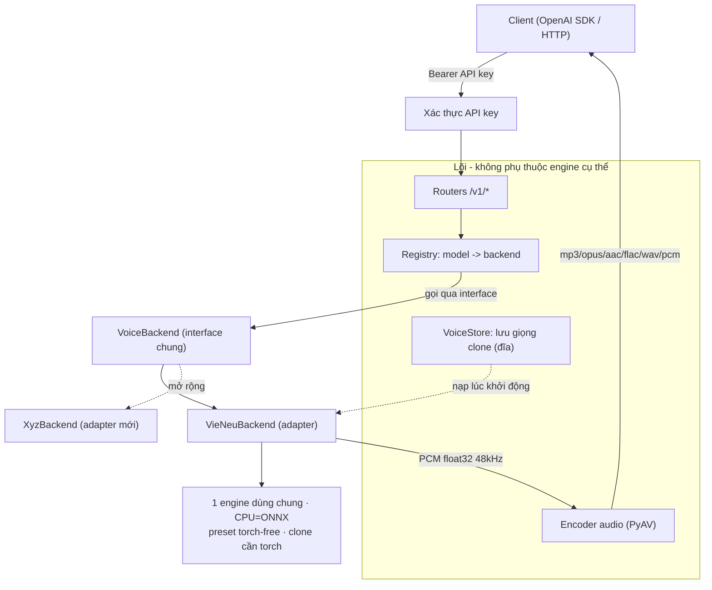
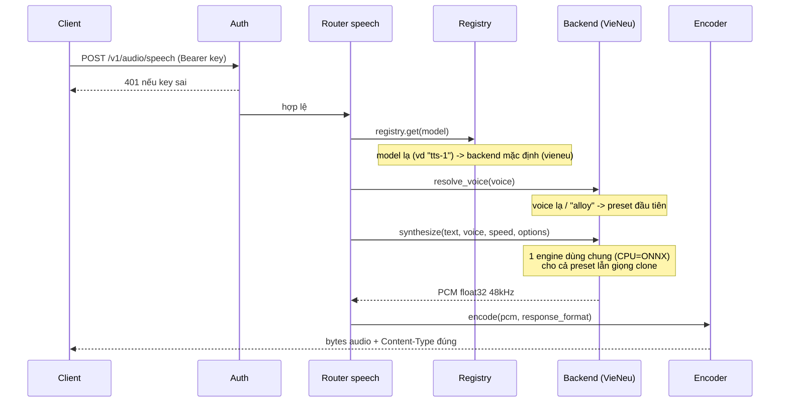
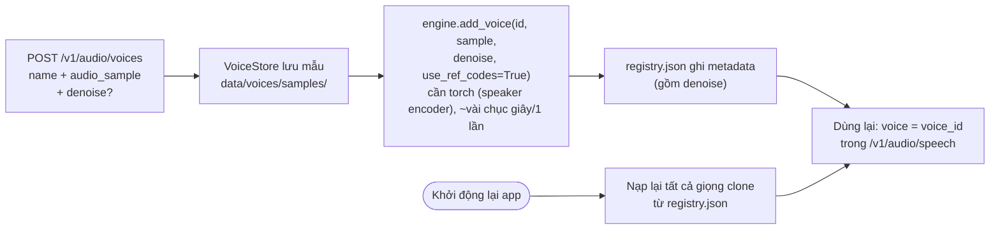
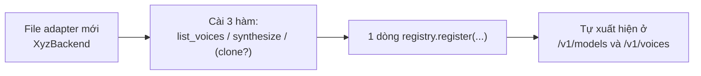
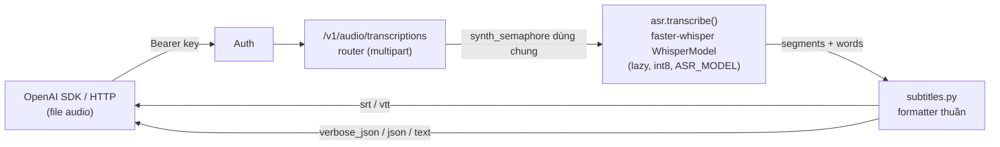
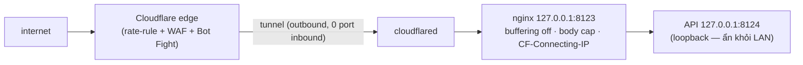

# all-voice — Kiến trúc & Cách mở rộng (tiếng Việt)

Tài liệu này giải thích hệ thống hoạt động thế nào, cách thêm một model voice
mới, cách cấu hình, và model tải về nằm ở đâu.

> Sơ đồ dùng cú pháp **Mermaid** — xem trực quan bằng VSCode (extension Mermaid),
> GitHub, hoặc bất kỳ trình xem Markdown nào hỗ trợ Mermaid.

---

## 1. Ý tưởng cốt lõi

Một **cổng TTS (text-to-speech)** phơi ra API **giống hệt OpenAI**, nhưng bên
dưới có thể cắm **nhiều "voice backend"** khác nhau. Lõi (core) không biết gì về
từng engine cụ thể — nó chỉ nói chuyện với một **interface chung** (`VoiceBackend`)
qua một **registry**. Thêm engine mới = viết **1 file adapter**, không sửa lõi.

Backend đầu tiên: **VieNeu-TTS** (tiếng Việt, chạy tốt trên CPU). VieNeu được
chọn làm **chuẩn tham chiếu** cho các tham số tinh chỉnh (style, ngắt nghỉ...);
backend khác sẽ *map* tên tham số của mình về chuẩn này, hoặc bỏ qua nếu không có.

Ưu tiên thiết kế: **(1) hiệu năng → (2) đơn giản (KISS) → (3) dễ mở rộng →
(4) CPU-first, GPU tùy chọn.**

---

## 2. Sơ đồ kiến trúc tổng quan



**Điểm mấu chốt:** Routers/Auth/Encoder/Schemas **chỉ** phụ thuộc vào `registry`
và interface `VoiceBackend`. Chúng **không import** một backend cụ thể nào.

---

## 3. Luồng xử lý một request `POST /v1/audio/speech`



Việc synth + encode là **CPU-bound/blocking** nên được đẩy sang threadpool, giới
hạn bởi `MAX_CONCURRENCY`. VieNeu **không thread-safe** → mọi lần synth bị
serialize bằng một khóa (lock) trong backend.

---

## 4. Các thành phần & file

| File | Vai trò |
|---|---|
| `app/main.py` | Tạo app, đăng ký backend, nạp lại giọng clone, gắn router, định dạng lỗi |
| `app/config.py` | Cấu hình từ `.env` (API keys, device, concurrency, thư mục giọng) |
| `app/auth.py` | Kiểm tra `Authorization: Bearer <key>` |
| `app/schemas.py` | Request/response (khớp OpenAI) + các knob tinh chỉnh |
| `app/backends/base.py` | **Interface `VoiceBackend`** + `Voice`, `AudioResult` |
| `app/backends/registry.py` | Bảng `model -> backend`, chọn backend mặc định |
| `app/backends/vieneu_backend.py` | Adapter VieNeu (1 engine chung; CPU=ONNX, clone cần torch) |
| `app/audio/encoder.py` | PCM → mp3/opus/aac/flac/wav/pcm (PyAV + stdlib) |
| `app/voice_store.py` | Lưu mẫu giọng clone + registry.json (đĩa) |
| `app/routers/speech.py` | `POST /v1/audio/speech` |
| `app/routers/speech_timing.py` | `POST /v1/audio/speech/timing` (mốc native VOICEVOX cho SRT, không đổi OpenAI speech) |
| `app/routers/transcriptions.py` | `POST /v1/audio/transcriptions` (speech-to-text; xem mục 11) |
| `app/routers/models.py` | `GET /v1/models` |
| `app/routers/voices.py` | `GET /v1/voices` (gộp preset + clone) |
| `app/routers/voices_admin.py` | CRUD giọng clone + consent (chuẩn OpenAI) |
| `app/asr/` | Module Speech-to-Text (tách khỏi TTS): `transcriber.py` (faster-whisper) + `subtitles.py` (formatter thuần) |

---

## 5. Cấu hình (`.env`) và các knob tinh chỉnh

**Biến môi trường:**

| Biến | Mặc định | Ý nghĩa |
|---|---|---|
| `API_KEYS` | `dev-key` | Danh sách key, phân tách bằng dấu phẩy |
| `DEVICE` | `cpu` | `cpu` (ONNX) / `cuda` / `auto` |
| `DEFAULT_BACKEND` | `vieneu` | Backend nhận model không nhận diện được |
| `MAX_CONCURRENCY` | `2` | Số job CPU song song tối đa — **dùng chung** cho synth (TTS) và transcribe (ASR) |
| `VOICES_DIR` | `data/voices` | Nơi lưu mẫu giọng clone |
| `ASR_MODEL` | `small` | Model faster-whisper (tiny/base/small/medium/large-v3 hoặc repo CT2) — xem mục 11 |
| `ASR_COMPUTE_TYPE` | `int8` | Kiểu tính CTranslate2: `int8` (CPU) / `float16` (CUDA) |
| `ENABLE_KOKORO` | `true` | Bật engine tiếng Anh Kokoro (đăng ký chỉ khi asset có — xem mục 12) |
| `KOKORO_MODEL_PATH` | `models/kokoro/kokoro-v1.0.int8.onnx` | Đường dẫn model ONNX Kokoro |
| `KOKORO_VOICES_PATH` | `models/kokoro/voices-v1.0.bin` | File voices Kokoro |
| `KOKORO_DEFAULT_VOICE` | `af_heart` | Preset trả về khi route lenient (model OpenAI-generic) |
| `ENABLE_VOICEVOX` | `true` | Bật engine tiếng Nhật VOICEVOX (đăng ký chỉ khi asset có — xem mục 12) |
| `VOICEVOX_DICT_DIR` | `models/voicevox/open_jtalk_dic_utf_8-1.11` | Thư mục OpenJTalk dict |
| `VOICEVOX_VVM_DIR` | `models/voicevox/vvms` | Thư mục chứa file VVM (voice model) |
| `VOICEVOX_ONNXRUNTIME` | `models/voicevox/onnxruntime/lib/libvoicevox_onnxruntime.so` | Lib ONNX Runtime (wheel KHÔNG kèm sẵn); `fetch-voicevox.sh` tải về path này + symlink độc lập version. Rỗng = dùng runtime sẵn trên loader path |
| `VOICEVOX_SPEAKER_ALLOWLIST` | *(bỏ trống)* | Lọc `style_id`/`uuid:style_id` được expose; rỗng = tất cả |
| `HF_HOME` | *(bỏ trống)* | Đổi thư mục cache model (xem mục 8) |

**Knob tinh chỉnh** (gửi qua `extra_body` của OpenAI SDK; client thường không bị
ảnh hưởng):

| Knob | Miền giá trị | Ý nghĩa |
|---|---|---|
| `style` | *(chuỗi tự do; backend tự quy định giá trị hợp lệ)* | Kiểu đọc. VieNeu chấp nhận `tu_nhien` / `tin_tuc` / `doc_truyen`; giá trị lạ → **400** (do backend từ chối, không phải schema) |
| `extra` | *(object tuỳ ý)* | Túi tham số **riêng của từng engine** (vd `speedScale` của một engine tương lai). Được gộp vào options; backend **bỏ qua** khoá nó không hiểu |

> **Định tuyến trung lập provider:** `style` không còn bị ép `Literal` trong schema
> chung — mỗi backend **tự validate** knob nó sở hữu (VieNeu ném `InvalidOption` →
> router map thành **400 `invalid_option`**). Nhờ đó `style="tin_tuc"` map sang
> engine khác được, và param mới của engine đi qua `extra` mà **không phải sửa
> schema**. `style` trùng khoá trong `extra` thì `style` thắng.

Các tham số sampling (`temperature`, `top_k`, `top_p`, `repetition_penalty`,
`silence_p`, `crossfade_p`, `max_chars`) **không còn là tham số đầu vào** — VieNeu
tự lo theo mặc định nội bộ (giống VieNeu Studio).

**Tốc độ đọc (`speed`, 0.25–4.0):** field được **giữ để tương thích OpenAI SDK**
và chuyển xuống backend, nhưng chỉ có tác dụng nếu backend có điều chỉnh tốc độ
gốc. VieNeu **không có** → `speed` là **no-op** với VieNeu. Gateway **không**
time-stretch (phase vocoder làm giảm chất lượng giọng).

**Không cần knob** (hoạt động sẵn trong `input`):
- **Ngắt nghỉ theo dấu câu:** viết `,` `.` `…`, xuống dòng → máy tự nghỉ.
- **Cảm xúc / phi ngôn ngữ:** nhúng `[cười]`, `[thở dài]`, `[hắng giọng]` vào text.
- **Song ngữ Việt–Anh:** tự động code-switch (không có tham số chọn ngôn ngữ).

> **Mapping cho backend khác:** vì tên knob theo VieNeu, adapter của backend khác
> sẽ tự dịch (vd `style="tin_tuc"` → tham số tương đương của engine đó), hoặc bỏ
> qua knob nó không hỗ trợ. Lõi không đổi.

---

## 6. Voice cloning — cách hoạt động & lưu trữ

**Clone cần PyTorch** — nhưng **không phải vì ONNX không clone được**. Một engine
ONNX **vẫn enrol clone được**; điểm mấu chốt là bước trích `speaker_emb` chạy qua
`OnnxSpeakerEncoder`, mà file này `import torch` ở top-level (dùng torch để tiền
xử lý fbank/tensor) — vì model v3-Turbo bật `use_speaker_embedding=True`. Đã kiểm
chứng thực nghiệm (chặn `torch`): **preset ONNX chạy được, `add_voice` thì fail**.
Do đó dùng **1 engine dùng chung** (CPU=ONNX): preset không cần torch, clone cần
thêm torch → gate bằng `supports_cloning = _torch_available()`.



- Mẫu lưu ở `data/voices/samples/`, metadata ở `data/voices/registry.json`.
- **Sống sót qua restart:** lúc khởi động, mỗi giọng được enrol lại vào engine
  **với đúng `denoise` đã lưu** → clone tái tạo y hệt.
- Enrol tốn ~vài chục giây/lần (một lần); synth giọng clone **nhanh hơn thời gian
  thực** (~2×). Xem số đo trong `plans/.../plan.md`.

**Clone cho chuẩn (fidelity):** `speaker_emb` + `ref_codes` (do `add_voice` trích)
quyết định chất giọng. Chỉ còn **một** knob đầu vào là `denoise` (persist theo giọng):

| Field | Mặc định | Khi nào đổi |
|-------|----------|-------------|
| `denoise` | `true` | Đặt **`false`** nếu mẫu **đã sạch** (thu studio) — khử nhiễu ép có thể làm mờ timbre. Giữ `true` cho mẫu ồn (điện thoại/phòng vang). |

> `use_ref_codes` luôn bật (`true`) bên trong (không còn là tham số đầu vào) để
> neo prosody/timbre — clone chuẩn nhất.

Mẫu tốt cũng quan trọng ngang knob: **3–8s, một người**, nền sạch (không nhạc/echo),
nói rõ đủ ngữ điệu. VieNeu tự trim silence 2 đầu + mono-hoá, **không** tự cắt clip
quá dài → clip dài/nhiều giọng làm loãng speaker embedding.

---

## 7. Cách thêm một model voice mới (đầy đủ)

Giả sử thêm engine tưởng tượng tên **Piper**. Chỉ **2 bước**, không đụng lõi:

**Bước 1 — Viết adapter** `app/backends/piper_backend.py`:

```python
from __future__ import annotations
import numpy as np
from .base import AudioResult, Voice, VoiceBackend

class PiperBackend(VoiceBackend):
    name = "piper"                 # == tên "model" client gửi lên
    supports_cloning = False       # engine này không clone

    def list_voices(self) -> list[Voice]:
        return [Voice(id="vi_female_1", name="Piper VN nữ", model=self.name, language="vi")]

    def synthesize(self, text, voice, speed=1.0, options=None) -> AudioResult:
        options = options or {}
        # Map knob chuẩn (VieNeu) sang tham số của Piper, bỏ qua cái không có:
        # vd: style -> preset riêng của Piper; knob nào Piper không có -> lờ đi.
        pcm = my_piper.tts(text)                 # -> np.float32 [-1, 1], mono
        return AudioResult(pcm=np.asarray(pcm, np.float32).reshape(-1), sample_rate=22050)
```

**Bước 2 — Đăng ký** trong `app/main.py::_register_backends()`:

```python
from .backends.piper_backend import PiperBackend
registry.register(PiperBackend())     # thêm đúng 1 dòng
```

Xong. Tự động có mặt trong `GET /v1/models` và `GET /v1/voices`; client gọi bằng
`model="piper"`. **Không sửa** router/schema/auth/encoder.

- **Ngôn ngữ = thuộc tính của voice:** gắn `language` cho mỗi `Voice` (vd `"ja"`,
  `"en"`). Client **chọn ngôn ngữ bằng cách chọn voice/model**, không có field
  `language` trên request TTS. Voice tự xuất hiện ở bộ lọc khám phá
  `GET /v1/voices?model=<tên>&language=<mã>` (cộng dồn) — không cần thêm code.
- **Định tuyến strict tự động:** `resolve_voice(voice, *, strict=…)` kế thừa từ
  `base` đã lo sẵn — client gọi **đích danh** model của bạn + voice lạ → **404
  `unknown_voice`**; model OpenAI-generic (`tts-1`) rơi về default vẫn **lenient**.
  Adapter thường **không cần** override.
- **Knob riêng engine:** validate knob bạn sở hữu và ném `InvalidOption` cho giá
  trị sai (router → **400**); đọc param riêng từ `options` (gồm cả `extra` của
  request). Khoá không hiểu thì bỏ qua.
- Muốn hỗ trợ clone: đặt `supports_cloning = True` và cài đặt thêm
  `register_voice(voice_id, name, sample_path, *, denoise=True, use_ref_codes=True, options=None)`
  + `remove_voice(voice_id)`. Engine cần **reference text** (vd F5) đọc
  `options.get("ref_text")`, thiếu → ném `InvalidOption`. `ref_text` được client
  gửi khi enrol (`POST /v1/audio/voices` form `ref_text`), **persist** trong
  `enrol_options` và tự truyền lại khi re-enrol lúc khởi động. Khi enrol, client
  chọn engine bằng form `model=<tên backend>` (thiếu → backend clone mặc định).
- Encoder tự lo mọi định dạng — adapter **chỉ cần trả PCM float32 + sample_rate**
  (sample_rate bao nhiêu cũng được, encoder xử lý; riêng `opus` cần 48/24/16/12/8kHz).

> **Trạng thái multi-engine:** ngoài VieNeu (VN), đã tích hợp **Kokoro (EN)** và
> **VOICEVOX (JA)** — xem **mục 12**. Cả hai là adapter in-process, không clone,
> đăng ký có guard `is_available()`. Engine clone-first tiếng Anh (Chatterbox/F5)
> để dành plan riêng khi có GPU.



---

## 8. Model tải về nằm ở đâu

Tải tự động **lần synth đầu tiên** về **HuggingFace cache**:

```
~/.cache/huggingface/hub/
  models--pnnbao-ump--VieNeu-TTS-v3-Turbo          (~226 MB, model chính)
  models--OpenMOSS-Team--MOSS-Audio-Tokenizer-Nano-ONNX  (~87 MB, bộ mã hoá audio)
```

Tổng ~**313 MB**. Trên Windows: `C:\Users\<user>\.cache\huggingface\hub\`.

**Đổi vị trí:** đặt `HF_HOME` (vd `HF_HOME=D:/youtube/all_voice/data/hf`) trước
khi chạy; model sẽ nằm trong `<HF_HOME>/hub/`. Mẫu giọng **clone** thì tách riêng
ở `data/voices/` (theo `VOICES_DIR`), không nằm trong HF cache.

---

## 9. CPU / GPU

- `DEVICE=cpu` (mặc định): 1 engine ONNX lo cả preset lẫn clone. Preset đọc
  torch-free; **enrol clone cần torch** (speaker encoder) → cài `--extra clone`.
- `DEVICE=cuda`: một engine PyTorch lo tất cả (nhanh trên GPU, có batch). Cần cài
  torch bản CUDA từ index của PyTorch, rồi đặt `DEVICE=cuda`.
- Cài bộ clone/GPU (PyTorch): `uv sync --extra clone`.

---

## 10. Chạy & kiểm thử

```bash
uv sync --extra clone
cp .env.example .env          # set API_KEYS
uv run uvicorn app.main:app --host 0.0.0.0 --port 8000
uv run pytest -q              # test đầu-cuối (synth thật + clone thật)
```

Chi tiết endpoint/schema **không** viết ở đây — xem **Swagger tự sinh** tại
`http://localhost:8000/docs` (thử API ngay trên trình duyệt), `/redoc`, hoặc
`/openapi.json`. Kế hoạch & số đo hiệu năng xem
`plans/260810-2317-openai-compat-tts-api/plan.md`.

---

## 11. Speech-to-Text (ASR) — module `app/asr/`

Chiều ngược lại của TTS: **audio → transcript + mốc thời gian**, phơi ra
`POST /v1/audio/transcriptions` (chuẩn OpenAI). Engine là
[faster-whisper](https://github.com/SYSTRAN/faster-whisper) (CTranslate2, int8 trên
CPU). **Chỉ nhận dạng — không dịch.** Cần extra `asr`: `uv sync --extra asr`.



**Vì sao tách riêng, không dùng registry.** ASR là **một engine duy nhất** (không
có nhu cầu đa-backend như TTS), nên dựng registry mới chỉ thêm phức tạp thừa (KISS).
Thay vào đó `app/asr/` là module độc lập, **tách hẳn** khỏi `app/backends/` (lõi TTS):
đổi/nâng ASR không đụng `VoiceBackend`/registry/router speech.

**Các seam chính:**

| Thành phần | Vai trò |
|---|---|
| `app/asr/transcriber.py` | `transcribe(audio_bytes, *, language, want_words, prompt, temperature)` → `TranscriptionResult`. Nạp model **lazy** (singleton toàn process, `_get_model()`) ở lần transcribe đầu — giống VieNeu. Thiếu faster-whisper → `AsrUnavailableError` (router bắt → 503). `is_available()` cho startup log. |
| `app/asr/subtitles.py` | Formatter **thuần** (không import faster-whisper): `to_srt` / `to_vtt` / `to_verbose_json` / `to_json` / `format_timestamp`. Test nhanh, tất định, không cần tải model. |
| `app/routers/transcriptions.py` | Router mỏng: multipart in, chạy off-thread dưới `synth_semaphore`, chọn 1 trong 5 `response_format`. |

**Ngân sách CPU dùng chung.** ASR **tái dùng `synth_semaphore`** (mục 3) chứ không
tạo semaphore riêng: TTS + ASR chia chung hạn mức `MAX_CONCURRENCY`. Máy khỏe hơn
chỉ cần tăng `MAX_CONCURRENCY`. faster-whisper tự decode + resample về 16kHz mono
qua `av`, nên không dùng `app/audio/encoder.py`.

**Karaoke (word-level).** `timestamp_granularities=["word"]` bật `word_timestamps`
→ `verbose_json` có mảng `words[]` chuẩn OpenAI (mỗi từ `start`/`end`). Gateway
**không** tự chế phụ đề gắn thẻ từng từ — tool tiêu thụ tự lo hiển thị. Độ chính xác
timing word dựa DTW của faster-whisper (đủ cho phụ đề/karaoke; forced-alignment như
WhisperX là nâng cấp tương lai, ngoài scope).

**Model tải về:** `ASR_MODEL` (mặc định `small` ~0.5GB) tải ở request transcribe
**đầu tiên**, cache chung `~/.cache/huggingface/hub` (mục 8). Đặt `ASR_MODEL=tiny`
cho máy yếu/test.

---

## 12. Engine tiếng Anh (Kokoro) & tiếng Nhật (VOICEVOX)

Hai engine preset **in-process, torch-free** (onnxruntime), **không clone**, sinh
audio **24 kHz** (encoder đã sample-rate-agnostic nên không sửa). Chúng cắm qua
đúng seam ở mục 7 — **không đụng lõi**. Đăng ký trong `_register_backends()` có
**guard**: chỉ vào registry khi `flag bật` **và** `is_available(settings)` (package
import được **và** file model/dict tồn tại). Thiếu → log 1 dòng, **không raise** →
deploy VieNeu-only nguyên vẹn. Khác VieNeu, `is_available(settings)` nhận `settings`
vì cần biết đường dẫn asset (VieNeu chỉ cần import được `vieneu`).

| | Kokoro (EN) | VOICEVOX (JA) |
|---|---|---|
| File | `app/backends/kokoro_backend.py` | `app/backends/voicevox_backend.py` |
| Runtime | `kokoro-onnx` (extra `en`) | `voicevox_core` (wheel từ GitHub release) |
| Giọng | 28 preset (bảng `_EN_VOICES`, 20 US / 8 UK) | speaker×style đọc từ metadata VVM |
| System dep | **`espeak-ng`** (G2P) | OpenJTalk dict (tải kèm) |
| Asset | `scripts/fetch-kokoro.sh` | `scripts/fetch-voicevox.sh` |

**Kokoro.** `kokoro.create(text, voice, speed, lang)` → PCM float32 24 kHz. Accent
suy từ prefix voice: `b*` = `en-gb`, còn lại `en-us`. `voices-v1.0.bin` chứa nhiều
ngôn ngữ nhưng adapter **chỉ expose 28 giọng English** (không auto-scan) để không
rò giọng ngôn ngữ khác. Thiếu `espeak-ng` → synth ném `RuntimeError` hướng dẫn cài
(không trả audio rỗng). `resolve_voice` override để miss-lenient rơi về
`KOKORO_DEFAULT_VOICE` thay vì giọng đầu bảng.

**VOICEVOX.** Init lazy 1 lần (`Onnxruntime` + `OpenJtalk` + `Synthesizer`).
**Lazy per-VVM:** `list_voices()` đọc **metadata** VVM (rẻ, không nạp model để
infer); chỉ `load_voice_model()` cho VVM chứa style được yêu cầu ở lần dùng đầu,
cache trong `_loaded`. Nhờ đó **startup không phình RAM** trên deploy 1-worker.
`voice` = `style_id` (hoặc `uuid:style_id`); `speed≠1.0` đi qua `audio_query` +
`speed_scale` (vì `tts()` không nhận speed). `VOICEVOX_SPEAKER_ALLOWLIST` lọc style
expose. **Credit** nhân vật nhúng sẵn trong `Voice.name` (chuỗi `VOICEVOX:<char>`)
để lộ ở `/v1/voices` — nghĩa vụ ghi công khi phát hành audio.

> **Fallback Docker HTTP (documented, chưa code):** nếu wheel `voicevox_core`
> không cài được cho Python/OS hiện tại, chạy VOICEVOX ENGINE qua Docker
> (`:50021`, `POST /audio_query` → `POST /synthesis`) và viết adapter biến thể
> chọn bằng một `voicevox_mode`. Không đụng lõi — chỉ đổi đường trong adapter.

**Test.** Unit (`-m "not synth"`) phủ `is_available` False, bảng 28 giọng,
`resolve_voice`, decode WAV, parse style/allowlist — **không cần model**. Test sinh
voice thật + round-trip TTS→ASR nằm dưới marker `synth`, **skip gọn** khi asset
vắng (`tests/test_kokoro.py`, `tests/test_voicevox.py`, `tests/test_tts_asr_roundtrip.py`).

---

## 13. Mở công khai không đăng nhập — tầng anon-gate, streaming, topology 1 cửa

Mục tiêu: mở TTS/ASR cho **người dùng free, không cần key**, chạy trên **1 máy CPU**
mà **không sập/treo** dù bị lạm dụng. Ba trụ: (a) topology "1 cửa" giấu API sau
nginx + Cloudflare Tunnel, (b) tầng gate tự bảo vệ theo **chi phí thật**, (c) một
endpoint **streaming** cho văn bản dài. Bật bằng `ANON_ENABLED=true`.

### 13.1 Topology "1 cửa"



API bind **loopback** (`HOST=127.0.0.1`, mặc định fail-closed) → chỉ nginx tới được.
nginx là cửa duy nhất, chuyển `CF-Connecting-IP` xuống app. **Loopback-gate:** app
**chỉ tin** header IP đó khi peer socket là loopback (đi qua nginx) — request gọi
thẳng không giả mạo được IP để né ngân sách. Cấu hình + checklist: `docs/deployment.md`,
`deploy/nginx.conf.example`, `deploy/cloudflare-tunnel.md`.

### 13.2 Hai tier + gate theo chi phí thật

| | ANON (không key) | TRUSTED (key hợp lệ) |
|---|---|---|
| Rate limit | token-bucket/IP (`ANON_RATE_PER_MIN`, `ANON_BURST`) | bỏ qua |
| Ngân sách ngày | ký tự (TTS) + giây audio (ASR) theo IP, lưu SQLite | bỏ qua |
| Admission | giới hạn đồng thời/IP + hàng đợi có trần | bỏ qua |
| CRUD giọng clone | **cấm** (401) | cho phép |

`resolve_tier` (`app/client_identity.py`) phân loại mỗi request; khám phá
(`/v1/voices`, `/v1/models`, nghe thử) **luôn công khai** cho cả hai. Gate tính theo
**đơn vị chi phí CPU thật** — ký tự cho TTS, giây audio cho ASR — chứ không chỉ đếm
request, nên một request "to" không lách được.

- **Rate + budget** (`app/quota.py`): token-bucket in-memory + bảng `usage(ip, day,
  chars, audio_ms)` trong SQLite (WAL, `busy_timeout`). **Fail-closed:** lỗi DB →
  từ chối (không cho qua miễn phí). **Reserve-then-refund:** trừ ngân sách trước khi
  synth, **hoàn lại** nếu request không giao được kết quả (net-zero khi lỗi).
- **IP chuẩn hoá** (`_normalize_ip`): IPv6 gộp về **/64**, IPv4 giữ /32 — chặn xoay
  vòng địa chỉ để nhân ngân sách.
- **Admission control** (`app/limits.py`): `admit(ip)` giới hạn số job đồng thời/IP
  + hàng đợi trần `MAX_QUEUE_WAITERS`; quá tải → **429 ngay**, chờ slot có timeout
  (`REQUEST_TIMEOUT_S`) → **không bao giờ treo vô hạn**. Vượt trần ký tự buffered →
  **400** (trỏ sang `/v1/audio/stream`); ASR quá dài → **413** trước khi tốn CPU.
- **1 worker bắt buộc:** gate là in-memory + SQLite một-người-ghi. App **từ chối khởi
  động** khi `ANON_ENABLED=true` và `workers>1` (`app/main.py`), tránh nhân giới hạn
  theo số worker + `database is locked`.

### 13.3 Streaming văn bản dài — `POST /v1/audio/stream`

Cho "đọc file dài": tách câu (`app/streaming.py::sentence_split`, gói đoạn ≤
`STREAM_MAX_CHUNK_CHARS`) rồi synth từng đoạn, **đẩy mp3 chảy dần**. Điểm mấu chốt:
**một container `av` liên tục** (`app/audio/encoder.py::Mp3StreamEncoder`) nạp từng
frame qua sink write-only — luồng ra là **một file mp3 liền mạch**, không ghép nối
per-câu (gapless theo thiết kế). Ngân sách **tính theo từng đoạn đã phát** (commit-
as-you-yield): client ngắt giữa chừng hoặc hết ngân sách → dừng sạch, chỉ trừ phần
đã đọc. nginx phải `proxy_buffering off` + app gửi `X-Accel-Buffering: no` để không
bị gom (né 524). Trần tổng theo tier: `ANON_MAX_CHARS_STREAM`.

### 13.4 Cache kết quả

`app/result_cache.py`: buffered-TTS (không phải stream) được cache trên đĩa theo
khoá SHA1 của `model|voice|text|speed|format|options` → request trùng trả ngay,
không synth lại. LRU quét nền theo thời gian truy cập, tới trần
`RESULT_CACHE_MAX_MB` / `RESULT_CACHE_MAX_FILES`. Tắt bằng `RESULT_CACHE_ENABLED=false`.

### 13.5 Chặn CPU đúng chỗ

Giới hạn thread trong app (`INFERENCE_THREADS`, `ASR_CPU_THREADS`) là lớp mềm — riêng
onnxruntime của VieNeu **có thể bỏ qua** `OMP_NUM_THREADS`. Vì vậy lớp chặn cứng thật
sự là **systemd `CPUQuota=`/`AllowedCPUs=`** (cgroup/taskset) trong
`deploy/install-service.sh`: một synth chạy loạn không thể ăn hết 6 nhân và treo máy.

> **Giai đoạn sau:** UI "xịn" (SPA React `frontend/` tương tác với các `/v1/*` endpoint);
> Cloudflare proxy + HTTPS + Rate limit cứng. MediaSource cho stream (nay client test dùng Blob);
> ngân sách/nhận diện dùng chung nhiều máy (Redis) khi vượt 1 node; đăng nhập +
> hạn mức theo tài khoản. Stage 1 cố tình giữ **in-memory + SQLite, 1 máy, 1 worker**.
