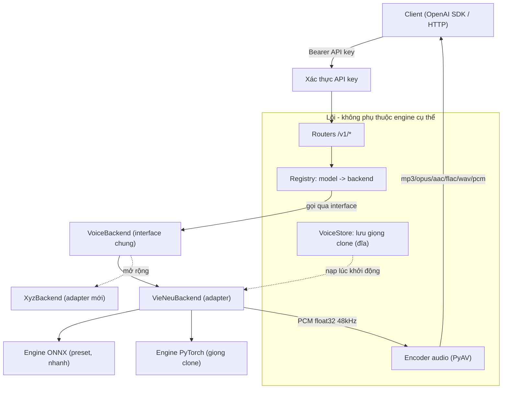
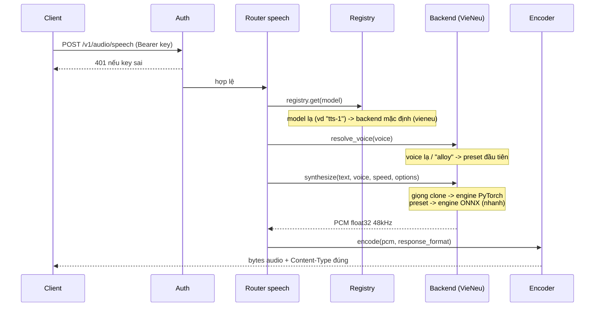
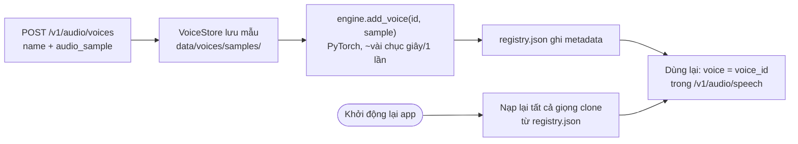
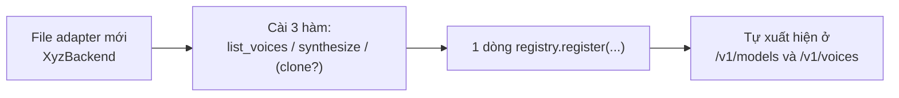

# all-voice — Kiến trúc & Cách mở rộng (tiếng Việt)

Tài liệu này giải thích hệ thống hoạt động thế nào, cách thêm một model voice
mới, cách cấu hình, và model tải về nằm ở đâu.

> Sơ đồ dùng cú pháp **Mermaid** — xem trực quan bằng VSCode (extension Mermaid),
> GitHub, hoặc bất kỳ trình xem Markdown nào hỗ trợ Mermaid.

---

## 1. Ý tưởng cốt lõi

Một **cổng TTS (text-to-speech)** phơi ra API **giống hệt OpenAI**, nhưng bên
dưới có thể cắm **nhiều "voice backend"** khác nhau. Lõi (core) không biết gì về
từng engine cụ thể — nó chỉ nói chuyện với một **interface chung** (`VoiceBackend`)
qua một **registry**. Thêm engine mới = viết **1 file adapter**, không sửa lõi.

Backend đầu tiên: **VieNeu-TTS** (tiếng Việt, chạy tốt trên CPU). VieNeu được
chọn làm **chuẩn tham chiếu** cho các tham số tinh chỉnh (style, ngắt nghỉ...);
backend khác sẽ *map* tên tham số của mình về chuẩn này, hoặc bỏ qua nếu không có.

Ưu tiên thiết kế: **(1) hiệu năng → (2) đơn giản (KISS) → (3) dễ mở rộng →
(4) CPU-first, GPU tùy chọn.**

---

## 2. Sơ đồ kiến trúc tổng quan



**Điểm mấu chốt:** Routers/Auth/Encoder/Schemas **chỉ** phụ thuộc vào `registry`
và interface `VoiceBackend`. Chúng **không import** một backend cụ thể nào.

---

## 3. Luồng xử lý một request `POST /v1/audio/speech`



Việc synth + encode là **CPU-bound/blocking** nên được đẩy sang threadpool, giới
hạn bởi `MAX_CONCURRENCY`. VieNeu **không thread-safe** → mọi lần synth bị
serialize bằng một khóa (lock) trong backend.

---

## 4. Các thành phần & file

| File | Vai trò |
|---|---|
| `app/main.py` | Tạo app, đăng ký backend, nạp lại giọng clone, gắn router, định dạng lỗi |
| `app/config.py` | Cấu hình từ `.env` (API keys, device, concurrency, thư mục giọng) |
| `app/auth.py` | Kiểm tra `Authorization: Bearer <key>` |
| `app/schemas.py` | Request/response (khớp OpenAI) + các knob tinh chỉnh |
| `app/backends/base.py` | **Interface `VoiceBackend`** + `Voice`, `AudioResult` |
| `app/backends/registry.py` | Bảng `model -> backend`, chọn backend mặc định |
| `app/backends/vieneu_backend.py` | Adapter VieNeu (ONNX preset + PyTorch clone) |
| `app/audio/encoder.py` | PCM → mp3/opus/aac/flac/wav/pcm (PyAV + stdlib) |
| `app/voice_store.py` | Lưu mẫu giọng clone + registry.json (đĩa) |
| `app/routers/speech.py` | `POST /v1/audio/speech` |
| `app/routers/models.py` | `GET /v1/models` |
| `app/routers/voices.py` | `GET /v1/voices` (gộp preset + clone) |
| `app/routers/voices_admin.py` | CRUD giọng clone + consent (chuẩn OpenAI) |

---

## 5. Cấu hình (`.env`) và các knob tinh chỉnh

**Biến môi trường:**

| Biến | Mặc định | Ý nghĩa |
|---|---|---|
| `API_KEYS` | `dev-key` | Danh sách key, phân tách bằng dấu phẩy |
| `DEVICE` | `cpu` | `cpu` (ONNX) / `cuda` / `auto` |
| `DEFAULT_BACKEND` | `vieneu` | Backend nhận model không nhận diện được |
| `MAX_CONCURRENCY` | `2` | Số job synth song song tối đa |
| `VOICES_DIR` | `data/voices` | Nơi lưu mẫu giọng clone |
| `HF_HOME` | *(bỏ trống)* | Đổi thư mục cache model (xem mục 8) |

**Knob tinh chỉnh** (gửi qua `extra_body` của OpenAI SDK; client thường không bị
ảnh hưởng). **VieNeu là chuẩn** — tên và ý nghĩa theo VieNeu:

| Knob | Miền giá trị | Ý nghĩa |
|---|---|---|
| `style` | tu_nhien / tin_tuc / doc_truyen | Kiểu đọc: tự nhiên / bản tin / kể chuyện |
| `temperature` | 0.1–2.0 | Cao = biểu cảm hơn; thấp = ổn định |
| `top_k` | 1–100 | Nucleus sampling |
| `top_p` | 0.0–1.0 | Nucleus sampling |
| `repetition_penalty` | 1.0–2.0 | Giảm lặp âm |
| `silence_p` | 0.0–2.0 | **Hệ số ngắt nghỉ** giữa các cụm |
| `crossfade_p` | 0.0–1.0 | Nối mượt giữa các đoạn |
| `max_chars` | 32–512 | Kích thước chunk khi chia câu dài |

**Tốc độ đọc (`speed`, 0.25–4.0):** VieNeu **không có** điều chỉnh tốc độ gốc, nên
gateway tự xử lý bằng **time-stretch giữ nguyên cao độ** (phase vocoder, librosa)
sau khi synth. Áp dụng cho **mọi backend** → `speed` của OpenAI luôn hoạt động.
`speed=1.0` bỏ qua (không xử lý).

**Không cần knob** (hoạt động sẵn trong `input`):
- **Ngắt nghỉ theo dấu câu:** viết `,` `.` `…`, xuống dòng → máy tự nghỉ.
  `silence_p` chỉ là hệ số nhân cho độ dài nghỉ đó.
- **Cảm xúc / phi ngôn ngữ:** nhúng `[cười]`, `[thở dài]`, `[hắng giọng]` vào text.
- **Song ngữ Việt–Anh:** tự động code-switch (không có tham số chọn ngôn ngữ).

> **Mapping cho backend khác:** vì tên knob theo VieNeu, adapter của backend khác
> sẽ tự dịch (vd `style="tin_tuc"` → tham số tương đương của engine đó), hoặc bỏ
> qua knob nó không hỗ trợ. Lõi không đổi.

---

## 6. Voice cloning — cách hoạt động & lưu trữ

VieNeu **clone bắt buộc dùng engine PyTorch** (ONNX không clone được — đã kiểm
chứng). Nên trên CPU dùng **2 engine**: ONNX cho preset (nhanh), PyTorch chỉ nạp
khi cần cho giọng clone → giữ đường nóng preset nhanh.



- Mẫu lưu ở `data/voices/samples/`, metadata ở `data/voices/registry.json`.
- **Sống sót qua restart:** lúc khởi động, mỗi giọng được enrol lại vào engine.
- Enrol tốn ~vài chục giây/lần (một lần); synth giọng clone **nhanh hơn thời gian
  thực** (~2×). Xem số đo trong `plans/.../plan.md`.

---

## 7. Cách thêm một model voice mới (đầy đủ)

Giả sử thêm engine tưởng tượng tên **Piper**. Chỉ **2 bước**, không đụng lõi:

**Bước 1 — Viết adapter** `app/backends/piper_backend.py`:

```python
from __future__ import annotations
import numpy as np
from .base import AudioResult, Voice, VoiceBackend

class PiperBackend(VoiceBackend):
    name = "piper"                 # == tên "model" client gửi lên
    supports_cloning = False       # engine này không clone

    def list_voices(self) -> list[Voice]:
        return [Voice(id="vi_female_1", name="Piper VN nữ", model=self.name, language="vi")]

    def synthesize(self, text, voice, speed=1.0, options=None) -> AudioResult:
        options = options or {}
        # Map knob chuẩn (VieNeu) sang tham số của Piper, bỏ qua cái không có:
        # vd: style -> preset riêng của Piper; silence_p -> Piper không có -> lờ đi.
        pcm = my_piper.tts(text)                 # -> np.float32 [-1, 1], mono
        return AudioResult(pcm=np.asarray(pcm, np.float32).reshape(-1), sample_rate=22050)
```

**Bước 2 — Đăng ký** trong `app/main.py::_register_backends()`:

```python
from .backends.piper_backend import PiperBackend
registry.register(PiperBackend())     # thêm đúng 1 dòng
```

Xong. Tự động có mặt trong `GET /v1/models` và `GET /v1/voices`; client gọi bằng
`model="piper"`. **Không sửa** router/schema/auth/encoder.

- Muốn hỗ trợ clone: đặt `supports_cloning = True` và cài đặt thêm
  `register_voice(voice_id, name, sample_path)` + `remove_voice(voice_id)`.
- Encoder tự lo mọi định dạng — adapter **chỉ cần trả PCM float32 + sample_rate**
  (sample_rate bao nhiêu cũng được, encoder xử lý; riêng `opus` cần 48/24/16/12/8kHz).



---

## 8. Model tải về nằm ở đâu

Tải tự động **lần synth đầu tiên** về **HuggingFace cache**:

```
~/.cache/huggingface/hub/
  models--pnnbao-ump--VieNeu-TTS-v3-Turbo          (~226 MB, model chính)
  models--OpenMOSS-Team--MOSS-Audio-Tokenizer-Nano-ONNX  (~87 MB, bộ mã hoá audio)
```

Tổng ~**313 MB**. Trên Windows: `C:\Users\<user>\.cache\huggingface\hub\`.

**Đổi vị trí:** đặt `HF_HOME` (vd `HF_HOME=D:/youtube/all_voice/data/hf`) trước
khi chạy; model sẽ nằm trong `<HF_HOME>/hub/`. Mẫu giọng **clone** thì tách riêng
ở `data/voices/` (theo `VOICES_DIR`), không nằm trong HF cache.

---

## 9. CPU / GPU

- `DEVICE=cpu` (mặc định): preset chạy ONNX (torch-free, nhanh nhất trên CPU);
  giọng clone chạy PyTorch (nạp lazy khi cần).
- `DEVICE=cuda` / `auto`: một engine PyTorch lo tất cả (nhanh trên GPU, có batch).
  Cần cài torch bản CUDA từ index của PyTorch, rồi đặt `DEVICE=cuda`.
- Cài bộ clone (PyTorch CPU/GPU): `uv sync --extra clone`.

---

## 10. Chạy & kiểm thử

```bash
uv sync --extra clone
cp .env.example .env          # set API_KEYS
uv run uvicorn app.main:app --host 0.0.0.0 --port 8000
uv run pytest -q              # test đầu-cuối (synth thật + clone thật)
```

Chi tiết endpoint/schema **không** viết ở đây — xem **Swagger tự sinh** tại
`http://localhost:8000/docs` (thử API ngay trên trình duyệt), `/redoc`, hoặc
`/openapi.json`. Kế hoạch & số đo hiệu năng xem
`plans/260810-2317-openai-compat-tts-api/plan.md`.
