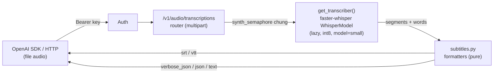

# asr-subtitle-transcriptions

## Overview

Thêm chiều **audio → transcript + timing** cho gateway (hiện chỉ có TTS). Endpoint
mới `POST /v1/audio/transcriptions` theo **đúng schema OpenAI transcriptions**, engine
là **faster-whisper** (CTranslate2, int8 trên CPU). Trả được file phụ đề **SRT/VTT**,
JSON đầy đủ (`verbose_json`) có mốc thời gian từng câu, và **tùy chọn timing từng từ**
(`timestamp_granularities[]=word`) cho hiệu ứng karaoke. Không dịch — chỉ nhận dạng +
gắn mốc thời gian.

## Contract (chốt với user)

- **Outcome:** `POST /v1/audio/transcriptions` nhận file audio → trả transcript kèm
  timing; `response_format` ∈ {`json`,`text`,`srt`,`vtt`,`verbose_json`}; hỗ trợ
  `timestamp_granularities[]` = `segment` (mặc định) và `word` (opt-in). Gọi được qua
  SDK `openai` không sửa gì.
- **Constraints:** CPU-only (i5-9400, 11GB RAM); pure-pip/uv; **không đụng lõi TTS**
  (`VoiceBackend`/registry/router speech); model ASR **mặc định `small`, đổi qua `.env`**;
  base install không nặng thêm (faster-whisper nằm trong optional extra `asr`).
- **Non-goals:** không dịch (translate); không streaming/real-time; không diarization
  (phân biệt người nói); không xây registry đa-engine cho ASR (một engine, seam tối giản);
  **không tự chế phụ đề word-timed** (VTT gắn thẻ từng từ) — chỉ trả `words` chuẩn OpenAI
  trong `verbose_json`, tool tiêu thụ tự lo hiển thị karaoke.
- **Acceptance:** xem Success Criteria.

## Goals

| # | Goal | Priority |
|---|------|----------|
| 1 | Endpoint `/v1/audio/transcriptions` tương thích OpenAI, trả SRT/VTT/verbose_json/text/json | P1 |
| 2 | Timing từng câu (segment) mặc định + tùy chọn từng từ (word/karaoke) | P1 |
| 3 | Chạy trên CPU, tiếng Việt, model `small` mặc định đổi được, không đụng lõi TTS | P1 |

## Phases

| # | Phase | Status |
|---|-------|--------|
| 1 | [Phase 1: Dependency & Config Foundation](./phase-01-start.md) | Done |
| 2 | [Phase 2: ASR Engine + Subtitle Formatters](./phase-02-asr-engine-and-config.md) | Done |
| 3 | [Phase 3: Transcriptions API Endpoint](./phase-03-transcriptions-api-endpoint.md) | Done |
| 4 | [Phase 4: Tests & Docs](./phase-04-tests-and-docs.md) | Done |

## Architecture

Seam mở rộng: `app/asr/` là module riêng, tách hẳn khỏi `app/backends/` (TTS). Một engine
duy nhất qua `get_transcriber()` (singleton lazy) — không dựng registry mới (KISS). Router
mỏng như `speech.py`; formatters là hàm thuần dễ test không cần tải model.

**Ngân sách CPU dùng chung:** ASR tái dùng `synth_semaphore` sẵn có (guard job CPU-bound),
KHÔNG thêm semaphore riêng — TTS + ASR chia chung hạn mức `MAX_CONCURRENCY` (mặc định 2),
máy khỏe hơn chỉ cần tăng `MAX_CONCURRENCY`. (Quyết định validation: đơn giản, cá nhân dùng.)

## Files (toàn plan)

- **Create:** `app/asr/__init__.py`, `app/asr/transcriber.py`, `app/asr/subtitles.py`,
  `app/routers/transcriptions.py`, `tests/test_transcriptions.py`
- **Modify:** `pyproject.toml` (extra `asr`), `app/config.py` (settings ASR: model + compute_type),
  `app/limits.py` (docstring: `synth_semaphore` giờ guard cả synth + transcribe),
  `app/schemas.py` (models transcription), `app/main.py` (mount router + tag + startup log),
  `README.md`, `docs/kien-truc-va-mo-rong.md`, `.env.example`
- **Delete:** none

## Success Criteria

- [x] `POST /v1/audio/transcriptions` với file audio VN → 200, transcript đúng, có mốc thời gian segment
- [x] `response_format=srt` → chuỗi SRT hợp lệ (`HH:MM:SS,mmm --> ...`); `vtt` → mở đầu `WEBVTT`, mốc dùng dấu chấm
- [x] `timestamp_granularities[]=word` + `verbose_json` → có mảng `words` top-level, mỗi từ có `start`/`end`
- [x] Gọi được qua `client.audio.transcriptions.create(...)` của SDK OpenAI, không sửa (endpoint theo đúng schema OpenAI; e2e xác nhận multipart + mọi format)
- [x] `ASR_MODEL` trong `.env` đổi được model (small ↔ medium/tiny…); mặc định `small` (test dùng `tiny`)
- [x] Thiếu extra `asr` → lỗi rõ ràng (503 + gợi ý `uv sync --extra asr`), không crash app (import lazy; test 503 xanh)
- [x] Toàn bộ test hiện có (25) vẫn xanh sau khi nâng `av` 13→18; test mới xanh (tổng **35 passed**)
- [x] Lõi TTS (speech/voices/models) không đổi hành vi (25 test TTS cũ vẫn xanh)

## Risks

- **Nâng `av` 13→18** (faster-whisper kéo av mới): encoder TTS có thể gãy. *Signal:*
  test_speech_formats fail. *Response:* chạy full e2e ngay sau khi thêm dep; nếu gãy,
  pin `av` xuống bản chung tương thích hoặc sửa call encoder.
- **RAM chật khi ASR + TTS cùng process** (11GB): *Signal:* OOM lúc transcribe cùng synth.
  *Response:* semaphore chung `MAX_CONCURRENCY` (mặc định 2) giới hạn tổng job CPU đồng thời;
  nếu vẫn chật, hạ `MAX_CONCURRENCY=1` hoặc dùng model `tiny`.
- **Model tải ở request đầu (~0.5GB cho small)** giống VieNeu: chấp nhận (đồng nhất hành vi),
  test dùng `ASR_MODEL=tiny` cho nhanh.

## Validation Log

### Session 1 (2026-08-29)

**Verification Results** (Standard tier, 4 phases)
- Claims checked: ~12 | Verified: 10 | Failed: 1 | Minor: 1
- VERIFIED: file lõi (config/limits/schemas/main/speech/voices_admin/auth/encoder), optional-deps `clone`, `.env.example` (DEVICE/MAX_CONCURRENCY), `tests/clone_1.wav` (44.1kHz stereo 7.45s — faster-whisper tự resample 16k mono), dep resolve (faster-whisper 1.2.1 + numpy 2.2.6 + av 18.1.0).
- FAILED: "14 test cũ" sai → thực tế **25 test** (20 hàm, `test_speech_formats` ×6). Đã sửa.
- MINOR: kwarg faster-whisper là `initial_prompt` (không phải `prompt`). Đã ghi rõ ở Phase 3.

**Decisions confirmed**
1. **Nâng `av` 13→18:** chấp nhận, để uv resolve; chạy full 25 test hồi quy ngay sau cài (Phase 1).
2. **Karaoke word-level:** chỉ trả `words` chuẩn OpenAI trong `verbose_json`; KHÔNG tự chế VTT gắn thẻ từng từ — tool tiêu thụ tự lo hiển thị. (Thu hẹp scope, đúng ý user.)
3. **Ngân sách CPU:** dùng chung `synth_semaphore` (bỏ semaphore ASR riêng); TTS+ASR chia chung `MAX_CONCURRENCY`; máy khỏe hơn tăng `MAX_CONCURRENCY`.

**Whole-Plan Consistency Sweep:** đã rà toàn bộ plan.md + 4 phase — không còn thuật ngữ cũ
(`asr_semaphore`, `asr_max_concurrency`, "14 test", "word-level opt-in" gây hiểu nhầm). 0 mâu thuẫn tồn đọng.

### Session 2 (2026-08-29) — Implementation + Code Review

**Kết quả:** 4 phase xong, **36 test xanh** (25 TTS cũ + 11 mới). av 13→18 không gây hồi quy TTS.

**Code review (code-reviewer subagent) — 4 phát hiện, đã sửa hết:**
1. **(HIGH)** File audio hỏng/không giải mã được → trả **500** thay vì 400. Sửa: thêm
   `InvalidAudioError` (bắt `av.error.FFmpegError`/`ValueError` trong `transcribe`), router →
   400 `invalid_audio_file`. Test: `test_undecodable_file_returns_400`.
2. **(MED)** `verbose_json` thiếu field `tokens` (OpenAI segment có). Sửa: thêm `tokens` vào
   dataclass `Segment` + `to_verbose_json` + schema `TranscriptionSegment`. (Field list ở Phase 2/3
   là gần đúng, không phải cố ý loại `tokens`; outcome plan là "đúng schema OpenAI".)
3. **(MED)** `_get_model()` không khóa → 2 request cold-start đồng thời nạp model 2 lần (nguy cơ OOM).
   Sửa: `threading.Lock` double-checked (đồng nhất pattern VieNeu backend).
4. **(LOW)** `language=""` không chuẩn hóa → cùng đường 500. Sửa: `language or None` (giống `prompt or None`).

Phát hiện #5 (semaphore chung ghép độ trễ ASR/TTS) là **chủ ý thiết kế đã ghi**, không sửa.

## Open Questions

None — tất cả quyết định đã chốt (engine faster-whisper, small mặc định đổi được,
words chuẩn OpenAI trong verbose_json, dùng chung ngân sách CPU, không dịch).
