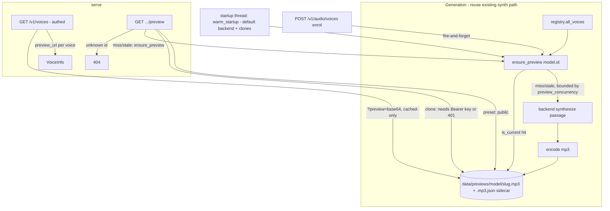

# voice-preview-samples

## Overview

Give every voice in `GET /v1/voices` a playable sample of a standard, language-
matched sentence — the way ElevenLabs/Azure expose a `preview_url`. Samples are
synthesized once (a language-correct passage per voice), cached to disk, and
served from a preview endpoint. **Preset previews are public** so a browser
`<audio src>` plays them with no header; **clone previews require an API key**
because they render a real person's cloned voice timbre. `?preview=base64`
inlines already-cached previews for one-request clients.

Brainstorm decisions (locked): **URL by default + base64 opt-in**, **both presets
and clones** get previews. Base64-always was rejected: with VOICEVOX's many styles
it bloats every `/v1/voices` poll to megabytes.

**Red-team decision (2026-08-30):** the original "no API key on any preview" was
revised — the brainstorm weighed only the sample *sentence* as non-sensitive, but
a *clone* preview exposes biometric voice timbre. Preset previews stay public;
clone previews now require a valid Bearer key. See `## Red Team Review`.

Brainstorm report: none written (decisions captured here).

## Goals

| # | Goal | Priority |
|---|------|----------|
| 1 | Each voice exposes a working `preview_url`; `GET` it returns playable mp3, no key needed | P1 |
| 2 | `?preview=base64` returns `preview_base64` that decodes to the same audio | P1 |
| 3 | Presets warmed to disk at startup (no synth on the request hot path); cold miss self-heals | P1 |
| 4 | Cloned voices get a preview shortly after enrol; deleting a clone removes its preview | P2 |
| 5 | Passage is language-correct per voice (vi/en/ja), configurable; rebuild is idempotent | P2 |

## Architecture (one picture)

Core rule preserved: **backends are untouched.** Preview logic lives in one new
module (`app/previews.py`) + the existing voices router; it only calls the
public `backend.list_voices()` / `backend.synthesize()` + shared `encode()`.

## Phases

| # | Phase | Status | Depends |
|---|-------|--------|---------|
| 1 | [Phase 1: Preview engine + config](./phase-01-start.md) | Done | — |
| 2 | [Phase 2: Preview API surface](./phase-02-preview-api-surface.md) | Done | 1 |
| 3 | [Phase 3: Startup warm + clone lifecycle](./phase-03-warm-and-clone-lifecycle.md) | Done | 1,2 |
| 4 | [Phase 4: Tests + docs](./phase-04-tests-and-docs.md) | Done | 1,2,3 |

## Non-goals

Streaming previews; multiple sample texts per voice; waveform/visualization;
signed-URL/token infra (endpoint is public by decision); CDN; changing the
default `/v1/voices` shape beyond additive fields.

## Key design decisions

- **Storage:** `data/previews/{slug(model)}/{slug(voice_id)}.mp3` + an atomic
  per-file **sidecar** `{slug}.mp3.json` (`{text_hash, language, style, format,
  voice_id, model}`). No central `manifest.json` → safe under `WORKERS≥2` (no
  shared-file R-M-W), no O(N²) rewrite. `slug` = sanitized id + short sha1
  (handles spaces like "Trúc Ly", VOICEVOX uuids, avoids collisions).
- **Format:** mp3 (`audio/mpeg`) — smallest, universally playable in `<audio>`.
- **Generation is one code path** (`ensure_preview`) reused by: startup warm,
  lazy self-heal on GET, and clone-enrol hook. `_LOCK` guards only a per-voice
  in-flight map (never held across synth); a unique tmp name + `os.replace` makes
  writes atomic across threads/workers; a post-synth ownership re-check prevents
  publishing a deleted voice.
- **Two CPU budgets:** paid `/v1/audio/speech`+ASR keep `synth_semaphore`
  (`max_concurrency`, default 2); preview synthesis uses a **separate**
  `preview_concurrency` budget (default 1) — previews never starve paid traffic
  and the preview route never holds a `synth_semaphore` permit.
- **Warm scope:** `warm_startup` eagerly warms the default backend's presets +
  clones only; VOICEVOX/Kokoro self-heal lazily so per-style VVM loading stays lazy.
- **Auth split:** preset previews public; clone previews require a valid Bearer key
  (clone = present in `voice_store`). Clone responses are `Cache-Control: private, no-store`.
- **Staleness:** the URL endpoint serves only a `is_current` (sidecar `text_hash`)
  file; `?preview=base64` inlines only already-current previews (never synth in the
  list call). A passage change → next GET regenerates.

## Success Criteria

- [x] `GET /v1/voices` → every voice has a `preview_url`.
- [x] `GET {preset preview_url}` with **no** `Authorization` header → 200, `audio/mpeg`, valid audio, `Cache-Control: public`.
- [x] `GET {clone preview_url}` **without** a key → 401; **with** a valid key → 200, `Cache-Control: private, no-store`.
- [x] `GET /v1/voices?preview=base64` → cached previews' `preview_base64` decode to the served bytes; not-yet-warmed voices are null (list call triggers no synth).
- [x] After startup warm, a preset `preview_url` is served from disk (no live synth); unknown model/voice → 404.
- [x] Creating a clone yields a playable preview shortly after; deleting it removes the mp3 + sidecar.
- [x] vieneu voice uses the vi passage, kokoro the en passage, voicevox the ja passage; a passage change regenerates on next GET; unchanged config regenerates nothing.
- [x] VieNeu previews are 48000 Hz; the `-m synth` test asserts that. Fast suite (`-m "not synth"`) passes using a FakeBackend. (`ruff` is not a project dep and the repo has no ruff config; new code introduces no lint category absent from the existing app/tests baseline.)

## Implementation Record

### Session — 2026-08-30 (ak:cook --auto)
**Status:** Delivered. All 4 phases implemented, code-reviewed, defects fixed, tests green.

**Verification:** fast suite `72 passed` (`-m "not synth"`); `-m synth` spot-checks — real VieNeu preview is non-silent **48000 Hz**, and a VieNeu synth+ASR round-trip passes (confirms the backend lock changes preserve parity).

**Code review (code-reviewer subagent) — findings addressed:**
- **H1 (High, security):** clone-vs-preset auth was derived only from live `voice_store` membership; a store/backend divergence (multi-worker post-delete, or an orphan) could serve cloned-voice audio **publicly**. Fixed: the sidecar now records `is_clone` (monotonic per artifact — a regeneration never downgrades it), and the route gates on the fail-closed **union** of live store + cached sidecar. Regression test added (`test_clone_preview_stays_keyed_when_store_record_gone`).
- **M1 (correctness):** the `python -m app.previews` warm guard was a no-op (`get_settings` was already lru-cached at import), spawning a duplicate warm thread. Fixed with `get_settings.cache_clear()`.
- **M3 (concurrency):** the new warm/enrol background threads made VieNeu's unlocked `_custom` dict racy (`RuntimeError: dictionary changed size during iteration`). Fixed: `list_voices` snapshots `_custom` under the lock; `register_voice`/`remove_voice` mutate under the lock.
- **M4 (docs):** softened the "previews can never starve paid TTS" claim to note VieNeu's shared engine-lock contention.
- **L2 (robustness):** `preview_concurrency=0` would hang every preview synth; the semaphore is clamped `≥1`.

**Accepted / deferred (documented non-blockers):** M2 (base64 does blocking file reads in the event loop for large warmed catalogs — opt-in, correctness unaffected), L1 (public route lets anon callers drive one-time first-synth, bounded by `_GEN_SEM=1` + cache + warm; matches the accepted public-preset decision), L3 (`_INFLIGHT` grows unbounded under heavy clone churn), L4 (`test_atomic_tmp_unique` is source-introspection), L5 (`warm_startup` O(N) `registry.json` re-parses, background-only).

**Intentional public-contract change:** the accepted design makes preset previews public, which broke `test_openapi_uses_bearer_security_scheme` (it required a Bearer scheme on *every* `/v1/*` op). Relaxed **only** the security-scheme assertion for `/v1/voices/{model}/{voice_id}/preview`; every other route and the no-`Authorization`-header-param check (all routes) stay enforced.

### Follow-up — 2026-08-30 (user decision): all previews public
The user reversed red-team findings 6/7: **clone previews are now public too** (no key), so a UI "nghe thử" button works straight off `preview_url` for every voice. The preview route is uniformly public (`public, max-age=86400`) — the clone key-gate, the `is_clone` sidecar field + monotonic logic, and `sidecar_marks_clone` were removed (dead once clones are public), along with the H1 divergence regression test (moot). Tradeoff accepted by the user: anyone holding a clone's exact preview URL can play the cloned timbre with no key (ids are still not enumerable via the public route). Re-gating later is a small change in `voice_preview`.

## Red Team Review

### Session — 2026-08-30
**Reviewers:** 3 (Security Adversary, Failure Mode Analyst, Assumption Destroyer), Standard verification tier.
**Findings:** 14 unique (all evidence-backed, all accepted). **Severity:** 2 Critical, 6 High, 6 Medium.
Three reviewers independently converged on the concurrency design (findings 1–3).

| # | Finding | Sev | Disposition | Applied To |
|---|---------|-----|-------------|-----------|
| 1 | `_LOCK` held across `synthesize()` → global serialization + priority inversion vs paid TTS/ASR | Critical | Accept | P1 (lock only around in-flight map) |
| 2 | "Bounded by `synth_semaphore`" false; warm+base64 bypass it; cold base64 = full-catalog inline synth | High | Accept | P1/P2 (`preview_concurrency`; base64 cached-only) |
| 3 | Multi-worker (`WORKERS≥2`): deterministic tmp name + in-process-only lock on shared `manifest.json` → corruption | Critical | Accept | P1 (unique tmp; per-file sidecar) |
| 4 | VieNeu `_get_engine()` unlocked → warm thread + first request double-init | High | Accept | P3 (double-checked lock) |
| 5 | Warm defeats VOICEVOX lazy VVM loading → RAM spike at boot | High | Accept | P1/P3 (`warm_startup` = default backend + clones) |
| 6 | Public clone preview exposes real-person voice timbre (biometric), CDN-cacheable | High | Accept (user decision) | P2 (clone previews require key; `private, no-store`) |
| 7 | Unauthenticated existence oracle enumerates clone ids | High | Accept (user decision) | P2 (clone 401 without key; preset oracle non-sensitive) |
| 8 | Deleted clone's preview served publicly & indefinitely; no prune | High | Accept | P1/P3 (post-synth ownership re-check; `prune_orphans`) |
| 9 | Stale passage: URL existence-only vs base64 text_hash → divergence | Medium | Accept | P1/P2 (`is_current` staleness on both) |
| 10 | Sample rate 24000→**48000**; breaks synth test | Medium | Accept | P1/P4 (assert 48000) |
| 11 | `python -m app.previews` double-warms (import runs `create_app`) | Medium | Accept | P3 (env guard before import) |
| 12 | Manifest full rewrite per voice under global lock → O(N²) | Medium | Accept | P1 (sidecar replaces manifest) |
| 13 | Orphan `.tmp` on crash; no sweep | Medium | Accept | P1 (try/finally unlink; `prune_orphans` sweeps `*.tmp`) |
| 14 | "Unknown id = no CPU" inaccurate — still O(voices) `list_voices` scan | Medium | Accept | P2 (claim corrected; preset scan non-sensitive, rate-limit out of scope) |

**Verified non-issues (not findings):** path traversal not viable (sha1-suffixed slug + slash collapse keep writes inside `data/previews`); `data/`+`*.mp3` are git-ignored (`.gitignore:17,32`); `_find_voice` correctly guards `registry.has` before the lenient `registry.get` (no wrong-backend synth); `style=""` moot (`ensure_preview` passes `{}`); warm-after-reenrol ordering correct (main.py:113-114). `VoiceInfo` additive fields break no test (only construction site voices.py:30; no test asserts exact key set).

### Whole-Plan Consistency Sweep
- Files reread: plan.md, phase-01-start.md, phase-02-preview-api-surface.md, phase-03-warm-and-clone-lifecycle.md, phase-04-tests-and-docs.md.
- Decision deltas checked: 8 (manifest→sidecar; global-lock→per-voice+`_GEN_SEM`; public→split auth; `path.exists`→`is_current`; base64→cached-only; `build_all` warm→`warm_startup`+prune; sample-rate 24000→48000; +`_get_engine` lock).
- Reconciled stale references: all — no remaining mention of `manifest.json`, "NO AUTH", `path.exists()`-only hot path, `synth_semaphore` bounding previews, or 24000 Hz across any phase.
- Unresolved contradictions: 0.

## Validation Log

### Session 1 — 2026-08-30
**Trigger:** User chose "Validate trước" after red-team; critical-questions interview before implementation.
**Questions asked:** 2 (verification pass skipped — `## Red Team Review` already carries file:line evidence per the validate guard; no `[UNVERIFIED]` tags remained).

#### Questions & Answers

1. **[Assumptions]** Đoạn văn mẫu ("nghe thử") mà mọi giọng sẽ đọc — dùng câu mặc định sẵn có, hay tự đặt câu thương hiệu ngay bây giờ?
   - Options: Dùng câu mặc định | Tôi sẽ tự đặt câu
   - **Answer:** Dùng câu mặc định
   - **Rationale:** Fixes the `DEFAULT_PASSAGES` content (Phase 1 step 2) as the shipped default; `PREVIEW_TEXT_VI/EN/JA` still override at runtime, so no code path changes.

2. **[Tradeoffs]** Có warm sẵn preview lúc khởi động app không? (default: BẬT — vieneu presets + clones; VOICEVOX/Kokoro lazy)
   - Options: Bật warm khi khởi động | Tắt warm, tạo lười
   - **Answer:** Bật warm khi khởi động
   - **Rationale:** Confirms `preview_warm_on_startup: bool = True` (Phase 1 config) and the background `warm_startup` daemon (Phase 3). First-hit latency avoided; boot CPU is bounded by `preview_concurrency=1` and runs off-thread, non-blocking.

#### Confirmed Decisions
- Sample passage: built-in `DEFAULT_PASSAGES` (vi/en/ja) — config-overridable, no custom text supplied.
- Startup warm: enabled by default (vieneu + clones); VOICEVOX/Kokoro stay lazy.

#### Action Items
- None. Both answers ratify existing plan defaults; no phase files edited.

#### Impact on Phases
- Phase 1: none (defaults unchanged).
- Phase 3: none (warm-on-startup unchanged).

### Whole-Plan Consistency Sweep
- Files reread: plan.md + phase-01..04. Both validation answers confirmed existing defaults, so no renamed fields/APIs, superseded decisions, or new prose/draft divergence were introduced.
- Reconciled: nothing to reconcile — no plan text changed as a result of validation.
- Unresolved contradictions: 0. Verification Results: Failed 0 → plan is eligible for implementation.

<!-- slug: voice-preview-samples -->
